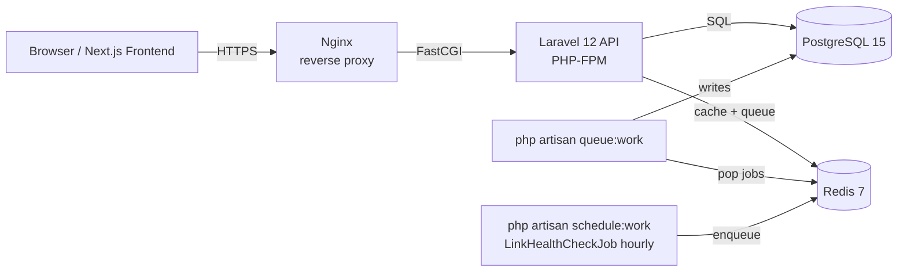

# System Architecture Overview

This diagram shows the top-level components of Link Chart and how traffic flows from a browser through Nginx into the Laravel API, backed by PostgreSQL for persistence and Redis for caching and queueing. It is the entry point for understanding how the system is structured at the infrastructure level.

The system follows a classic layered approach: the Next.js frontend communicates exclusively with the Laravel API through Nginx (which terminates TLS and handles load balancing). Laravel owns all business logic and delegates persistence to PostgreSQL for relational data and Redis for high-frequency operations. In development the entire stack runs via `docker-compose up -d`; production mirrors this layout on a single VPS using `docker-compose.prod.yml`.

Redis serves a dual role: application cache (slug lookups cached for 10 minutes via `Link::findActiveBySlugCached()`) and the job queue consumed by `php artisan queue:work` workers. Using a single Redis instance for both concerns keeps the infrastructure surface small; `predis/predis` is the client library. The 8 log channels described in CLAUDE.md (`redirect`, `tracking`, `jobs`, `auth`, `audit`, `http`, `app`, `errors`) all write through the standard Laravel logging stack and land on the host filesystem under `storage/logs/`.

What this diagram intentionally omits: there is no CDN in front of Nginx (the current audience size does not justify it); there are no dedicated worker-only nodes (web and queue workers run in the same containers in production); and there is no separate analytics pipeline (all analytics are computed at query time against the `clicks` table in PostgreSQL).
