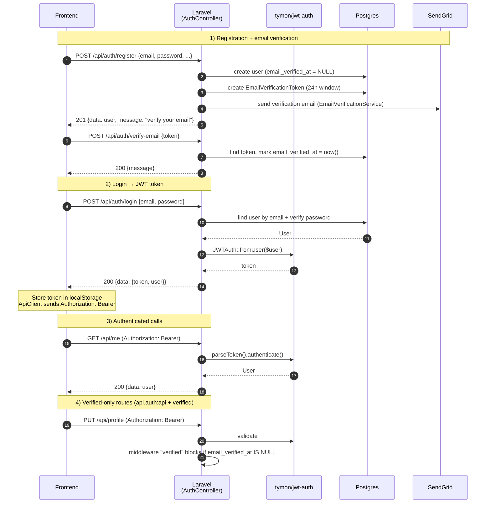

# Authentication and Email Verification Flow

This diagram covers the full authentication lifecycle: user registration with email verification, password-based login producing a JWT token, authenticated API calls, and the middleware guard that protects verified-only routes.

The middleware stack uses two guards in sequence: `api.auth` (the `ApiAuthenticate` middleware) validates the Bearer token via `tymon/jwt-auth` and hydrates the authenticated user; `verified` (the `EnsureEmailIsVerified` middleware) then checks `email_verified_at` and rejects the request with 403 if the field is null. Login attempts are rate-limited by `throttle:login` (5 requests per minute, keyed by email address or IP address) to prevent brute-force attacks.

Token windows are deliberately asymmetric: email verification tokens expire after 24 hours and password reset tokens after 1 hour. Both are stored as `EmailVerificationToken` rows in Postgres rather than being encoded in the JWT, allowing explicit revocation. Two convenience endpoints — `resendVerificationEmail` and `checkEmailVerificationStatus` — sit inside the `api.auth:api`-only route group (no rate limit and no `verified` guard), which was flagged as a gap in the security audit: a verified-but-compromised account could spam the resend endpoint.

The Google OAuth route (`POST /api/auth/google`) was removed in commit `79e3411` (audit finding R-09) because the corresponding `googleLogin` controller method was never implemented — the route was a leftover stub. The JWT package is pinned to `tymon/jwt-auth: dev-chore/laravel-12` for Laravel 12 compatibility; upgrade this dependency once an official release supports Laravel 12.
