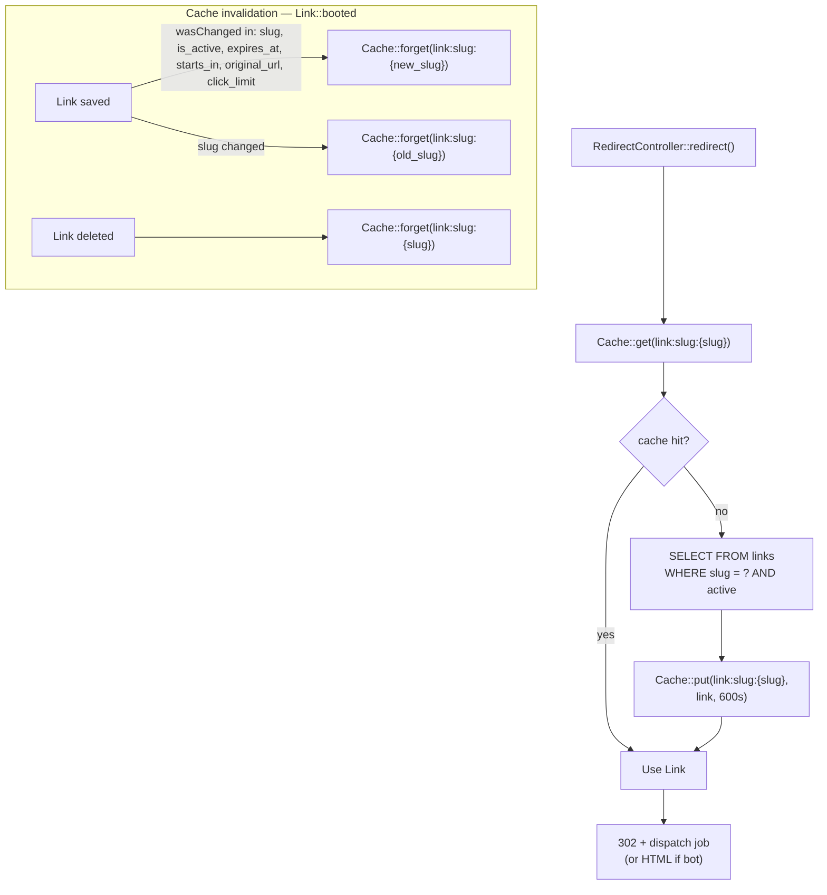

# Link Slug Cache Strategy

The slug cache is the system's primary performance optimization: it keeps the hot redirect path off Postgres under traffic spikes. A cached `Link` record lives for 10 minutes and is evicted only when fields that affect redirect behaviour change.

The source of truth is `app/Models/Link.php`. The cached lookup is implemented in `findActiveBySlugCached(string $slug): ?self`, which uses the cache key `link:slug:{slug}` with a TTL defined by the `Link::CACHE_TTL_SECONDS = 600` constant. Cache invalidation is registered inside `static::booted()` and fires on the model's `saved` and `deleted` Eloquent events.

Invalidation is **selective**: only a save that changed one of the six fields `[slug, is_active, expires_at, starts_in, original_url, click_limit]` triggers a cache flush. This avoids spurious churn from unrelated column updates. Notably, the `links.clicks` increment performed by `LinkTrackingService::registrarCliqueFromPayload` uses a direct `DB::table->increment` query that **bypasses model events entirely** — high-frequency click counter updates therefore do NOT invalidate the slug cache.

The 10-minute TTL is a deliberate trade-off: worst-case staleness of 10 minutes when a user deactivates a link or renames a slug (acceptable for the product), in exchange for keeping Postgres out of the redirect hot path. This is the **only** Eloquent-level cache in the codebase; everything else is computed at request time. **Hard Rule:** the field list `[slug, is_active, expires_at, starts_in, original_url, click_limit]` MUST stay byte-identical with the actual guard inside `booted()`. Adding a column whose value should invalidate the slug cache requires updating that list in `app/Models/Link.php` (see `app/Models/README.md` for the canonical invariant).
