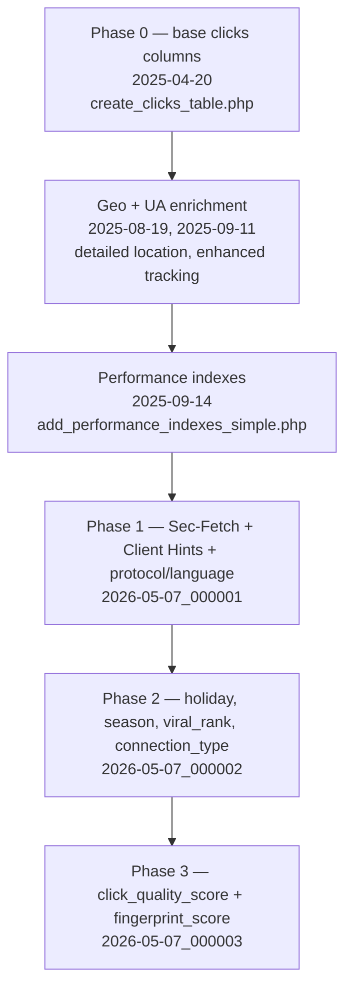

# Clicks Table — Enrichment Phases

The `clicks` table has grown through successive append-only migration phases, each adding tracking columns without removing existing ones. The diagram below shows the chronological grouping; `database/migrations/README.md` contains the canonical narrative and column inventory.

The schema is **append-only**: every phase added columns; nothing was removed. The ordering is not arbitrary — Phase 2 references columns introduced in Phase 1 in certain queries (e.g. `language_region` set in Phase 1 feeds the `holiday` lookup in Phase 2), and Phase 3 references both. Migrations must not be reordered or squashed; doing so would break the dependency chain and any environment that replays them from scratch.

All writes to these columns originate in `LinkTrackingService::registrarCliqueFromPayload`, invoked inside `ProcessLinkClickJob`. Unit tests for each phase live at `tests/Unit/Services/Links/LinkTrackingPhase{1,2,3}Test.php` and use reflection to exercise private helper methods. The reads happen in the analytics services: `AudienceAnalyticsService`, `GeographicAnalyticsService`, `TemporalAnalyticsService`, and `InsightsAnalyticsService` all aggregate over these columns, with phase-specific logic concentrated in the generators under `app/Services/Analytics/Insights/Generators/`.

Phase 3 detail (corrected from earlier audit documentation): the column is `fingerprint_score` (unsigned tinyint, count of header inconsistencies in the range 0–3), **not** `fingerprint_consistency` as some earlier docs implied. `click_quality_score` is the aggregate tier classification derived from velocity and fingerprint data. Both are written by `ClickVelocityService::record` combined with the phase-specific helpers in `LinkTrackingService`. Any future phase that adds quality-signal columns must also update the `ClickVelocityService` aggregation logic to keep the score meaningful.
