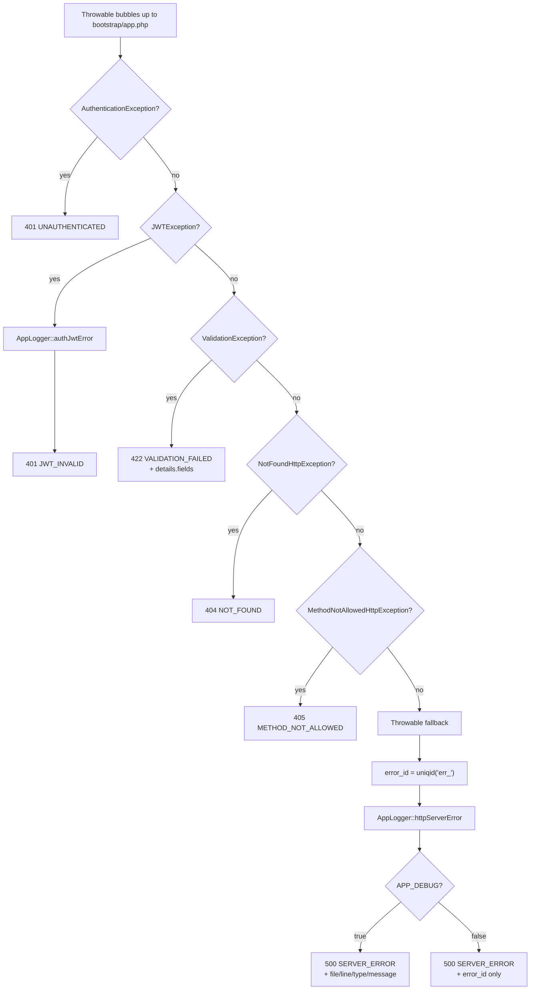

# Error Handling — Centralized Exception to JSON Envelope

All unhandled exceptions bubble up to a single handler registered in `bootstrap/app.php` (lines 56–145). The handler converts every throwable into a consistent JSON envelope for API clients, while letting Laravel's default renderer handle non-API requests.

The handler is configured via the `->withExceptions(...)` block in the Laravel 12 application bootstrap. Every renderer checks `$request->isApiRequest()` first — a `Request::macro` registered in `AppServiceProvider::boot()`. When the request is not an API request the renderer returns `null`, delegating to Laravel's built-in HTML error pages. For API requests, each branch produces a `JsonResponse` immediately without falling through to the framework.

Every API error response shares the same envelope shape: `{error: {code: STRING, message: STRING, details?: OBJECT}}`. Status codes are consistent across the entire codebase: 401 for missing or invalid authentication (differentiated by code `UNAUTHENTICATED` vs `JWT_INVALID`), 404 for unknown routes, 405 for wrong HTTP method, 422 for validation failures (which include a `details.fields` map of field-level messages), and 500 for all remaining throwables.

The 500 fallback generates an `error_id` via `uniqid('err_')`, logs the full exception through `AppLogger::httpServerError` (which writes to both the `http` and `errors` channels), and embeds the id in the response under `details.error_id`. Support teams correlate this id against those log channels to retrieve the full stack trace. `APP_DEBUG=true` additionally exposes `file`, `line`, `type`, and `message` inside `details` to ease local development; **production must run with `APP_DEBUG=false`** to avoid leaking implementation details to clients.
