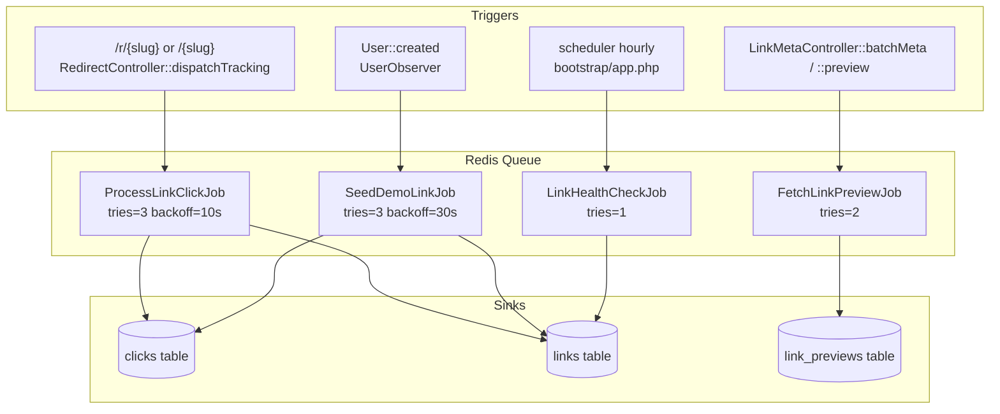

# Asynchronous Jobs Flow

This diagram maps every job in the system to its trigger, its retry configuration, and the database tables it writes to. All four jobs run on the default Redis queue and are the sole owners of the system's asynchronous side effects.

Each job has a distinct idempotency profile that determines how safe retries are. `ProcessLinkClickJob` is **not idempotent**: a retry on transient DB failure produces a duplicate row in `clicks`, resulting in a slightly inflated click count — this under-precision is accepted as a trade-off for simplicity. `SeedDemoLinkJob` is **not idempotent**: it relies on the `User::created` observer firing exactly once per registration; a retry would create duplicate demo links. `FetchLinkPreviewJob` **is idempotent**: it uses `updateOrCreate` keyed on `link_id`, so retries are safe. `LinkHealthCheckJob` **is idempotent**: it is a pure re-check that overwrites the health status on each run. When any job exhausts its retry budget, `AppLogger::jobFailed` writes a structured entry to the `jobs` log channel (retained 14 days).

`LinkHealthCheckJob` uses `withoutOverlapping()` to prevent concurrent executions from piling up on the queue if the health check takes longer than its scheduling interval. Its `handle` method processes links in chunks of 50 to avoid memory exhaustion. Taken together, the four jobs own all asynchronous writes in the system — every other operation (link creation, analytics queries, auth actions) is synchronous within the HTTP request/response cycle and returns a response before any background work begins.
