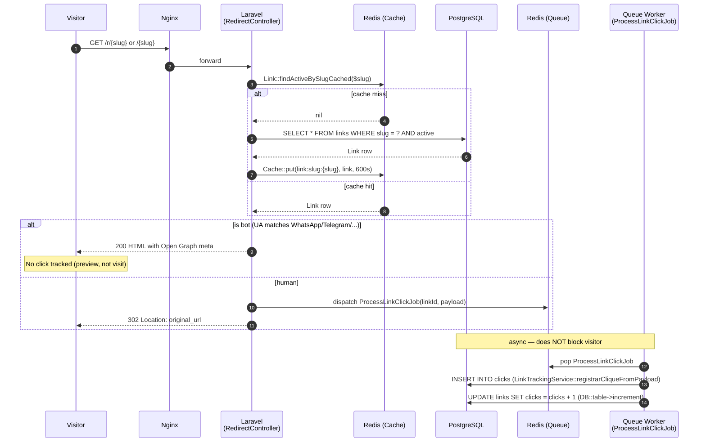

# Redirect Flow

This diagram documents the critical path for the `/r/{slug}` (and `/{slug}`) redirect route — the heart of Link Chart. It is marked **LOCKED**: the sequence described here reflects existing, tested behavior and must not be changed without updating both the tests and ADR 0003.

This route lives in `routes/web.php` rather than `routes/api.php` for two reasons: it must serve raw HTML (with Open Graph and Twitter Card meta-tags) to bot crawlers so that link previews work correctly in WhatsApp, Telegram, and similar platforms; and it performs a direct 302 redirect for human visitors without routing through the Next.js SPA. The previously disabled `/api/r/{slug}` route (commented out in `routes/api.php` since 2025-11-04) is preserved as documentation — see ADR 0003. Do not reopen it without a compelling justification and a matching test update.

Cache invariants are locked: the slug cache TTL is 10 minutes; invalidation is triggered by changes to the fields `[slug, is_active, expires_at, starts_in, original_url, click_limit]` inside `Link::booted()`. The `links.clicks` counter increment happens inside `ProcessLinkClickJob` via `LinkTrackingService::registrarCliqueFromPayload`, not in the controller — the controller only dispatches the job. This keeps the HTTP response latency minimal and the cache entry stable.

Rate limiting is enforced by `throttle:redirect` (600 requests per minute per IP), registered in `bootstrap/app.php`. Two named routes share the same controller action: `/r/{slug}` (`public.redirect`) and `/{slug}` (`public.redirect.clean`, constrained by regex `[^/]+`). The clean-URL alias was introduced in commit `46bb550`. The `?preview=1` query parameter renders the Open Graph HTML without dispatching a tracking job, enabling link preview debugging without polluting analytics.
