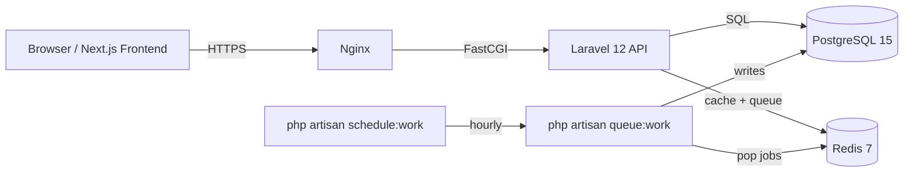
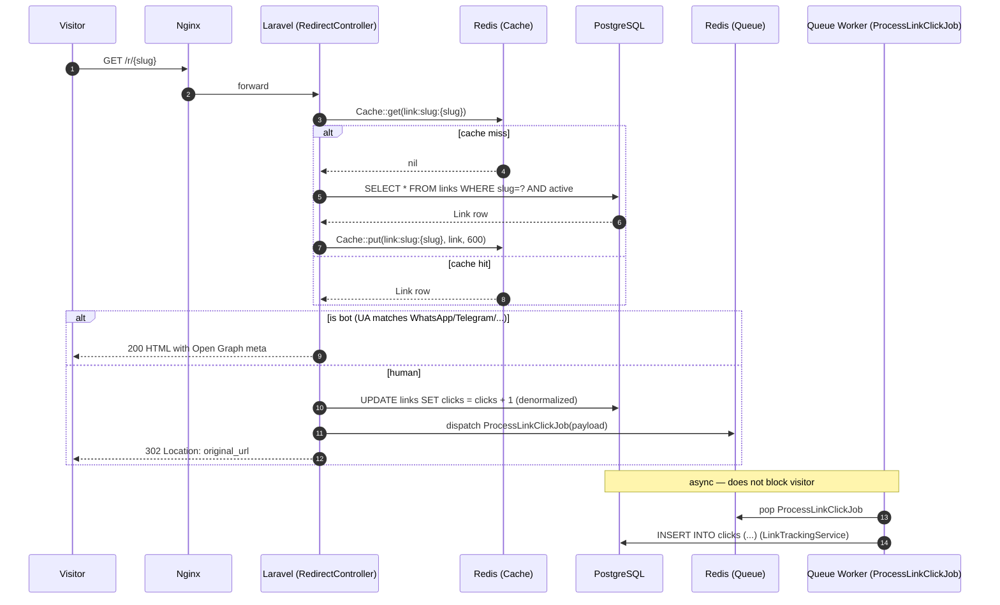
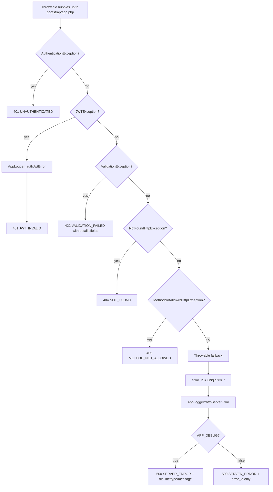
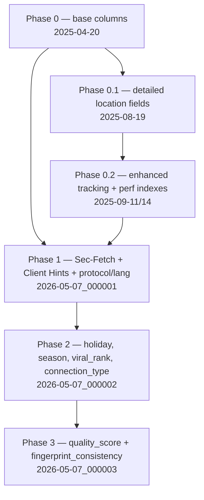

# Backend Consolidation & Documentation Implementation Plan

> **For agentic workers:** REQUIRED SUB-SKILL: Use superpowers:subagent-driven-development (recommended) or superpowers:executing-plans to implement this plan task-by-task. Steps use checkbox (`- [ ]`) syntax for tracking.

**Goal:** Bring the linkcharts backend (Laravel 12 / PHP 8.2) into a maintainable, navigable, fully documented state — auditing the codebase, applying approved clarity refactors, completing PHPDoc, and producing READMEs / diagrams / ADRs / `CONTRIBUTING.md` — **with 100% functional parity (no new features, no schema changes, no contract changes).**

**Architecture:** Eight sequential, human-gated phases executed in order on `main` (no long-lived branch). Phase 1 is read-only audit. Phase 2 is approved refactors only. Phases 3–8 are documentation-only (PHPDoc, READMEs, root README, Mermaid diagrams, ADRs, `CONTRIBUTING.md`). Every phase ends with a quality gate (`phpunit` + `pint --test` + `phpstan analyse` + diff review + migrations untouched) and a STOP for human approval before continuing.

**Tech Stack:** PHP 8.2, Laravel 12, PostgreSQL 15, Redis 7, Eloquent, `tymon/jwt-auth` (`dev-chore/laravel-12`), `torann/geoip`, `jenssegers/agent`, `azuyalabs/yasumi`, `sendgrid/sendgrid`, `predis/predis`, `larastan/larastan`, `phpunit/phpunit`, Laravel Pint. CI: GitHub Actions (`ci.yml` runs `php artisan test` + `pint --test`). Deploy: VPS DigitalOcean via `docker-compose.prod.yml` triggered by `deploy-production.yml` calling `scripts/deploy.sh`.

---

## Working Directory

All commands assume:

```bash
cd /Users/bruno/Projects/link-charts/backend
```

All paths in this plan are **relative to `backend/`** unless otherwise noted.

The backend repo is its own git repository inside the parent monorepo (`backend/.git` exists). Commit and push from inside `backend/`.

---

## Hard Rules (PARITY INVARIANTS — applies to every phase)

These rules govern every commit. Re-read before each task.

**Allowed:**
- ✅ Rename classes / methods / properties / namespaces for clarity (must update all call sites in same commit).
- ✅ Move files within the layered structure (Controllers / Services / Repositories / Models / Contracts / DTOs).
- ✅ Extract traits / helpers, consolidate duplicates, tighten internal logic.
- ✅ Tighten types (PHP 8.2 `readonly`, `enum`, `never`, union/intersection) — **never loosen**.
- ✅ Replace docblock-only types with real PHP type hints when safe.
- ✅ Run `vendor/bin/pint` to normalize formatting **only when approved** and **in an isolated commit**.
- ✅ Refactor private/protected internals provided public API (signatures, return types, exceptions thrown) is byte-identical and existing tests still pass.

**Forbidden:**
- ❌ Add any new feature — endpoint, artisan command, job, event, listener, middleware, scope, cast, observer.
- ❌ Remove "dead" code without absolute certainty. When unsure, leave it and add `// TODO(orphan?):` above it.
- ❌ Modify HTTP API contract: request/response payloads, status codes, headers, error shape (`{error: {code, message, details?}}`), `error_id` generation.
- ❌ Modify any `database/migrations/*.php` file (none — including the 3 click-enrichment phases of 2026-05-07).
- ❌ Re-enable `/api/r/{slug}` (intentionally disabled in `routes/api.php` since 2025-11-04).
- ❌ Touch `routes/web.php` `/r/{slug}` or its alias `/{slug}` without preserving: `302` status, OG tags served to bots, `ProcessLinkClickJob` dispatch order/timing. `RedirectTest` and `ProcessLinkClickJobTest` must remain green.
- ❌ Modify `Link::findActiveBySlugCached()` or `Link::booted()` without preserving the **10-minute TTL** and the exact invalidation field list: `['slug', 'is_active', 'expires_at', 'starts_in', 'original_url', 'click_limit']`.
- ❌ Modify `bootstrap/app.php` exception handlers without preserving: error envelope shape, `error_id` generation (`uniqid('err_')`), `http`/`errors` log channels, `APP_DEBUG`-conditional details.
- ❌ Change job `tries` / `backoff` / queue: `ProcessLinkClickJob` (tries=3, backoff=10), `SeedDemoLinkJob` (tries=3, backoff=30), `FetchLinkPreviewJob` (tries=2), `LinkHealthCheckJob` (tries=1).
- ❌ Change `LinkHealthCheckJob` schedule (`hourly()->withoutOverlapping()` in `bootstrap/app.php::withSchedule()`) or its internal chunk size (50).
- ❌ Change `/api/links/batch-meta` response fields (`sparkline`, `trend`, `preview`, `health`).
- ❌ Invent behavior. If something is unclear, read the tests + call sites; if still unclear, mark `// TODO(doc):` and move on.

**Commit rules (from global + observed git log):**
- Conventional Commits: `type(scope): description` (lowercase subject, ≤72 chars, no trailing period, imperative mood).
- Common types observed in repo: `feat`, `fix`, `refactor`, `chore`, `docs`, `test`, `perf`, `style`, `ci`, `build`.
- **Never** add `Co-Authored-By: Claude` or any AI/Anthropic reference in commit messages.
- One concern per commit. Refactor commits do not include doc changes; doc commits do not include refactor changes.

---

## Quality Gate (run after every commit, every phase)

This block is referenced from every phase. Run it verbatim.

```bash
# 1. Tests — full PHPUnit suite, with config cache cleared first
php artisan config:clear
vendor/bin/phpunit
# Expected: tests, assertions, OK. No new skips. Critical:
#   - Tests\Feature\RedirectTest must be green.
#   - Tests\Feature\ProcessLinkClickJobTest must be green.

# 2. Pint formatting (--test = no rewrite, exit 1 on diff)
vendor/bin/pint --test
# Expected: no files would be changed.

# 3. Static analysis (larastan via phpstan)
vendor/bin/phpstan analyse --memory-limit=2G
# Expected: same baseline. No new errors. (Baseline file: phpstan-baseline.neon, 577 lines.)

# 4. Migrations untouched
git status database/migrations/
# Expected: empty (clean).

# 5. Diff review (eyeball)
git diff --stat
# Phases 3–8 (doc): only .md and PHPDoc blocks should appear.
# Phase 2 (refactor): only approved items + their call-site updates.
```

**If `phpunit` fails: STOP immediately, do not commit, report the failure.**
**If a doc-phase diff contains logic changes: STOP, revert, report.**
**If `database/migrations/` shows any modification: STOP, revert.**

---

## File Structure (what this plan creates / edits)

This is the full inventory of files the plan touches. No file outside this list should be modified during a documentation phase.

**Created (Phase 1 — audit):**
- `docs/_audit/backend-inventory.md`

**Created (Phase 4 — domain READMEs):**
- `app/Http/Controllers/Auth/README.md`
- `app/Http/Controllers/Links/README.md`
- `app/Http/Controllers/Analytics/README.md`
- `app/Services/README.md`
- `app/Repositories/README.md`
- `app/Jobs/README.md`
- `app/Models/README.md`
- `database/migrations/README.md`

**Created (Phase 6 — diagrams):**
- `docs/diagrams/architecture.md`
- `docs/diagrams/redirect-flow.md`
- `docs/diagrams/auth-flow.md`
- `docs/diagrams/jobs-flow.md`
- `docs/diagrams/caching-strategy.md`
- `docs/diagrams/error-handling.md`
- `docs/diagrams/clicks-enrichment.md`

**Created (Phase 7 — ADRs):**
- `docs/adr/0001-arquitetura-em-camadas.md`
- `docs/adr/0002-contracts-com-binding-explicito.md`
- `docs/adr/0003-redirect-canonico-em-web-php.md`

**Created (Phase 5 / 8):**
- `README.md` (rewrite — overwrites the existing 60-line README)
- `CONTRIBUTING.md` (new)
- `.env.example` (new — derived from `.env`/`.env.local`, secrets stripped)

**Modified (Phase 3 — PHPDoc, in place):**
- All 8 controllers in `app/Http/Controllers/**/*.php`.
- All 16 services in `app/Services/**/*.php`.
- All 3 repositories in `app/Repositories/*.php`.
- All 7 contracts in `app/Contracts/**/*.php`.
- All 7 models in `app/Models/*.php` and the observer.
- All 4 jobs in `app/Jobs/*.php`.
- All 4 DTOs in `app/DTOs/*.php`.

**Modified (Phase 2 — refactor):** Whatever the human approves from the Phase 1 audit. Cannot be enumerated until Phase 1 finishes.

---

## Phase 0: Preflight (one-time, run before Phase 1)

Confirm the workspace is clean and the test suite is green BEFORE we touch anything. If anything here fails, stop and report — we don't start the plan on a broken main.

### Task 0.1: Confirm clean state and green tests

**Files:** none changed.

- [ ] **Step 1: Confirm working tree is clean**

```bash
git status
```

Expected: `nothing to commit, working tree clean` (the parent monorepo's `?? backend/` from outer `git status` is irrelevant here — we're inside `backend/.git`).

- [ ] **Step 2: Confirm the current branch and remote**

```bash
git branch --show-current
git remote -v
```

Expected: branch `main`, remote pointing to `bcordeirodev/linkchart-backend` (or equivalent). If on another branch, stop and ask which branch the plan should run on.

- [ ] **Step 3: Run the full quality gate (baseline)**

Run the four quality-gate commands from the **Quality Gate** section above. Capture and record the output. This is the baseline every subsequent commit must match or improve.

- [ ] **Step 4: Record baseline numbers in plan progress notes**

```bash
vendor/bin/phpunit 2>&1 | tail -3 > /tmp/baseline-phpunit.txt
vendor/bin/phpstan analyse --memory-limit=2G --no-progress 2>&1 | tail -3 > /tmp/baseline-phpstan.txt
vendor/bin/pint --test 2>&1 | tail -3 > /tmp/baseline-pint.txt
```

Expected: phpunit reports OK; pint reports clean (commit `1ec4533 style: apply pint formatting across codebase` already normalized everything); phpstan reports the existing baseline error count.

- [ ] **Step 5: Confirm `.env.testing` and `phpunit.xml` are consistent**

`phpunit.xml` forces `DB_CONNECTION=sqlite`, `DB_DATABASE=:memory:`, `CACHE_STORE=array`, `QUEUE_CONNECTION=sync`. Per the project memory `config_cache_tests`, config cache **must** be cleared before running tests (already in the `composer test` script and in `composer test`). Confirm `php artisan config:clear` runs cleanly.

```bash
php artisan config:clear
```

Expected: `INFO  Configuration cache cleared successfully.`

**No commit for this phase.** Phase 0 is a check; it produces no diff.

**STOP — report baseline numbers and confirm green before starting Phase 1.**

---

## Phase 1: Audit (read-only + 1 inventory document)

Produce a complete, navigable inventory of the backend. The output of this phase is the input to every subsequent phase. **Read everything; change one file: `docs/_audit/backend-inventory.md`.**

### Task 1.1: Create the inventory file skeleton

**Files:**
- Create: `docs/_audit/backend-inventory.md`

- [ ] **Step 1: Create the directory and file with the section skeleton**

```bash
mkdir -p docs/_audit
```

Write `docs/_audit/backend-inventory.md` with exactly these top-level headings (content filled in subsequent tasks):

```markdown
# Backend Inventory — 2026-05-10

> Snapshot of the linkcharts backend (Laravel 12 / PHP 8.2). Source for the consolidation plan at `docs/superpowers/plans/2026-05-10-backend-consolidation-and-documentation.md`.
> **Read-only audit.** No code is changed by writing this document.

## 1. Controllers
## 2. Services
## 3. Repositories
## 4. Contracts
## 5. DTOs
## 6. Models (and Observers)
## 7. Jobs
## 8. Middlewares
## 9. Providers / Bindings
## 10. Console (Commands + Schedule)
## 11. Logging
## 12. Routes
## 13. Migrations (chronological — schema is intocável)
## 14. Tests coverage
## 15. Backend domain → Frontend feature mapping
## 16. Oportunidades de refactor
## 17. Suspeitos de código órfão
## 18. Estado do PHPDoc
## 19. Resumo executivo
```

- [ ] **Step 2: Commit the skeleton**

```bash
git add docs/_audit/backend-inventory.md
git commit -m "docs(audit): scaffold backend inventory skeleton"
```

### Task 1.2: Inventory controllers (Section 1)

**Files:**
- Modify: `docs/_audit/backend-inventory.md` — section 1.

- [ ] **Step 1: For each controller file, capture: full class path, public actions, route(s) it serves (verb + path + middleware), services injected, and any FormRequest/Resource it uses**

Files to read (8 controllers):
- `app/Http/Controllers/BaseController.php`
- `app/Http/Controllers/MetricsController.php`
- `app/Http/Controllers/Auth/AuthController.php`
- `app/Http/Controllers/Links/LinkController.php`
- `app/Http/Controllers/Links/LinkMetaController.php`
- `app/Http/Controllers/Links/PublicLinkController.php`
- `app/Http/Controllers/Links/RedirectController.php`
- `app/Http/Controllers/Analytics/AnalyticsController.php`

For each, fill a table row in `## 1. Controllers`:

```markdown
### Auth/AuthController
| Action | Route | Middleware | Dependencies | FormRequest / Resource |
|---|---|---|---|---|
| login | POST /api/auth/login | throttle:login | EmailService, EmailVerificationService | — |
| register | POST /api/auth/register | throttle:login | … | … |
…
```

Cross-reference `routes/api.php` (lines 40–124) and `routes/web.php` (lines 68–78) to fill the Route column.

- [ ] **Step 2: Commit the controllers section**

```bash
git add docs/_audit/backend-inventory.md
git commit -m "docs(audit): inventory controllers and routes served"
```

### Task 1.3: Inventory services (Section 2)

**Files:**
- Modify: `docs/_audit/backend-inventory.md` — section 2.

- [ ] **Step 1: For each service file, list public methods, contract implemented (if any), repositories/services consumed, and any cache/queue/external side effects**

Files to read (16 services):
- `app/Services/EmailService.php`
- `app/Services/EmailVerificationService.php`
- `app/Services/Links/ClickVelocityService.php`
- `app/Services/Links/LinkAuditService.php`
- `app/Services/Links/LinkPreviewService.php`
- `app/Services/Links/LinkSafetyService.php`
- `app/Services/Links/LinkService.php`
- `app/Services/Links/LinkTrackingService.php`
- `app/Services/Onboarding/OnboardingDemoDataService.php`
- `app/Services/Analytics/AudienceAnalyticsService.php`
- `app/Services/Analytics/DashboardAnalyticsService.php`
- `app/Services/Analytics/GeographicAnalyticsService.php`
- `app/Services/Analytics/InsightsAnalyticsService.php` (+ 8 generators in `Insights/Generators/` + `Insights/InsightGeneratorRegistry.php` + `Insights/InsightGeneratorInterface.php`)
- `app/Services/Analytics/LinkAnalyticsOrchestrator.php`
- `app/Services/Analytics/MetricsService.php`
- `app/Services/Analytics/TemporalAnalyticsService.php`
- `app/Services/Analytics/Support/UserAgentParser.php`

For each, write a subsection like:

```markdown
### Services/Links/LinkTrackingService
- **Contract:** none
- **Public methods:** `registrarCliqueFromPayload(array $payload): Click`, `enrichPhase1(...)`, `enrichPhase2(...)`, `enrichPhase3(...)`
- **Consumes:** GeoIp facade, `jenssegers/agent` Agent, ClickVelocityService, AppLogger
- **Side effects:** writes to `clicks` table, logs to `tracking` channel
- **Notes:** invoked exclusively by `ProcessLinkClickJob`; payload pre-normalized in RedirectController
```

- [ ] **Step 2: Commit the services section**

```bash
git add docs/_audit/backend-inventory.md
git commit -m "docs(audit): inventory services with contracts and side effects"
```

### Task 1.4: Inventory repositories (Section 3) and contracts (Section 4)

**Files:**
- Modify: `docs/_audit/backend-inventory.md` — sections 3 + 4.

- [ ] **Step 1: For each repository (`app/Repositories/*.php`: `LinkRepository`, `ChartRepository`, `WordRepository`), list public methods, the model it touches, and any non-trivial query (joins, raw SQL, `selectRaw`, `groupBy`, custom indexes used)**

Pattern:

```markdown
### Repositories/LinkRepository
- **Contract:** `Contracts\Repositories\LinkRepositoryInterface`
- **Model:** `Link`
- **Methods:** `…`
- **Non-trivial queries:** `findUserLinksWithStats(int $userId)` — uses index `idx_links_user_active`
```

- [ ] **Step 2: For each contract (`app/Contracts/**/*.php`, 7 files), record: implementer + binding location**

Bindings live in `app/Providers/AppServiceProvider.php` (lines 16–32). Quote each `bind()` call.

```markdown
### Contracts
| Contract | Implementer | Bound in |
|---|---|---|
| `Repositories\LinkRepositoryInterface` | `Repositories\LinkRepository` | AppServiceProvider:16 |
| `Services\LinkServiceInterface` | `Services\Links\LinkService` | AppServiceProvider:21 |
| `Analytics\DashboardAnalyticsInterface` | `Services\Analytics\DashboardAnalyticsService` | AppServiceProvider:26 |
| `Analytics\GeographicAnalyticsInterface` | `Services\Analytics\GeographicAnalyticsService` | AppServiceProvider:27 |
| `Analytics\TemporalAnalyticsInterface` | `Services\Analytics\TemporalAnalyticsService` | AppServiceProvider:28 |
| `Analytics\AudienceAnalyticsInterface` | `Services\Analytics\AudienceAnalyticsService` | AppServiceProvider:29 |
| `Analytics\InsightsAnalyticsInterface` | `Services\Analytics\InsightsAnalyticsService` | AppServiceProvider:30 |
```

- [ ] **Step 3: Commit**

```bash
git add docs/_audit/backend-inventory.md
git commit -m "docs(audit): inventory repositories and contract bindings"
```

### Task 1.5: Inventory DTOs (Section 5) and Models + Observers (Section 6)

**Files:**
- Modify: `docs/_audit/backend-inventory.md` — sections 5 + 6.

- [ ] **Step 1: For each DTO in `app/DTOs/`, record: properties, where used (input to which service/controller), output of which method**

Files: `CreateLinkDTO.php`, `CreatePublicLinkDTO.php`, `LinkDTO.php`, `UpdateLinkDTO.php`.

Use `grep -rn "use App\\\\DTOs\\\\" app/ tests/` to find call sites.

- [ ] **Step 2: For each model in `app/Models/`, record: relationships, casts, scopes, observers, any non-trivial method**

Files: `User`, `Link`, `Click`, `LinkAudit`, `LinkPreview`, `LinkUtm`, `EmailVerificationToken`.

Pattern:

```markdown
### Models/Link
- **Table:** `links`
- **Relationships:** `user()` (BelongsTo User), `clicks()` (HasMany Click), `preview()` (HasOne LinkPreview)
- **Casts:** none non-trivial
- **Scopes:** none
- **Observers:** none registered (uses `static::booted()` for cache invalidation)
- **Cache:** `findActiveBySlugCached(string $slug): ?self` — TTL 10 min, invalidated on save when any of [`slug`, `is_active`, `expires_at`, `starts_in`, `original_url`, `click_limit`] changes; invalidated on delete; key from `slugCacheKey(string $slug)`
- **Helpers:** `isExpired()`, `hasReachedClickLimit()`, `getRemainingClicks()`, `getShortedUrl()`
```

- [ ] **Step 3: Document `app/Models/Observers/UserObserver.php`** — registered in `AppServiceProvider::boot()` line 36; reacts to `User::created` by dispatching `SeedDemoLinkJob`.

- [ ] **Step 4: Commit**

```bash
git add docs/_audit/backend-inventory.md
git commit -m "docs(audit): inventory DTOs, models, and observers"
```

### Task 1.6: Inventory jobs (Section 7)

**Files:**
- Modify: `docs/_audit/backend-inventory.md` — section 7.

- [ ] **Step 1: For each of the 4 jobs, record: trigger, queue (if specified), `tries`, `backoff`, side effects, idempotency notes**

Verified facts (from grep of `app/Jobs/*.php`):

| Job | tries | backoff | trigger | side effects |
|---|---|---|---|---|
| `ProcessLinkClickJob` | 3 | 10s | `RedirectController::redirect()` (after 302) | writes to `clicks`, increments `links.clicks`, logs to `tracking` channel |
| `SeedDemoLinkJob` | 3 | 30s | `UserObserver::created` | creates demo Link + seeds Clicks; logs to `jobs`/`app` |
| `FetchLinkPreviewJob` | 2 | (default) | dispatched from `LinkPreviewService` (verify trigger) | writes to `link_previews`; HTTP fetch of OG metadata |
| `LinkHealthCheckJob` | 1 | (default) | scheduler `hourly()->withoutOverlapping()` in `bootstrap/app.php:10` | updates `links.health_*` columns; chunks of 50 |

Verify each by reading the job file and noting trigger call site.

- [ ] **Step 2: Commit**

```bash
git add docs/_audit/backend-inventory.md
git commit -m "docs(audit): inventory jobs with trigger, tries, and side effects"
```

### Task 1.7: Inventory middlewares (Section 8), providers (Section 9), console (Section 10), logging (Section 11)

**Files:**
- Modify: `docs/_audit/backend-inventory.md` — sections 8, 9, 10, 11.

- [ ] **Step 1: Middlewares — list all 7**

Files in `app/Http/Middleware/`: `ApiAuthenticate`, `AssignRequestId`, `EnsureEmailIsVerified`, `MetricsCollector`, `NormalizeApiResponse`, `RedirectMetricsCollector`, `TrustProxies`.

For each: alias (from `bootstrap/app.php` lines 47–52 + `web()`/`api()` stacks at lines 29–45), purpose (1 line), any side effects.

- [ ] **Step 2: Providers — `AppServiceProvider` only**

Single provider. Record: bindings (all 7 from Task 1.4), `boot()` work — `User::observe(UserObserver::class)`, `Request::macro('isApiRequest', …)`, the 4 `RateLimiter::for(…)` registrations (`login` 5/min, `public-shorten` 10/min, `public-analytics` 30/min, `redirect` 600/min).

- [ ] **Step 3: Console**

3 artisan commands in `app/Console/Commands/`: `OptimizeApiCommand` (`api:optimize`), `TestEmailCommand` (signature?), `UpdateExistingLinksUrls` (signature?). Read each, record signature + purpose.

Schedule (from `bootstrap/app.php:9-11`): `LinkHealthCheckJob` `hourly()->withoutOverlapping()`. Nothing else.

- [ ] **Step 4: Logging**

Channels live in `config/logging.php` (8 channels per CLAUDE.md): `redirect`, `tracking`, `jobs`, `auth`, `audit`, `http`, `app` (default), `errors`.

Components in `app/Logging/`:
- `AppLogger` (51 public static methods — front facade; **never call `Log::*` directly**, per CLAUDE.md)
- `Context/RequestContext` + `Context/HasLogContext` trait
- `Taps/ChannelTap`, `Taps/SampleRateTap`
- `Formatters/KeyValueFormatter`
- `Processors/RequestContextProcessor`, `Processors/PiiRedactionProcessor`

Record: which middleware injects `request_id` (`AssignRequestId`), how it propagates to jobs (`HasLogContext` trait), and how it appears in records (`RequestContextProcessor`).

- [ ] **Step 5: Commit**

```bash
git add docs/_audit/backend-inventory.md
git commit -m "docs(audit): inventory middlewares, providers, console, and logging"
```

### Task 1.8: Inventory routes (Section 12) and migrations (Section 13)

**Files:**
- Modify: `docs/_audit/backend-inventory.md` — sections 12 + 13.

- [ ] **Step 1: Routes — copy the full route table**

Run:

```bash
php artisan route:list --json > /tmp/routes.json
```

In Section 12, write a Markdown table of every route: method, URI, middleware, action. Group by file (web vs api). Highlight the disabled `/api/r/{slug}` (commented in `routes/api.php` lines 31–32).

- [ ] **Step 2: Migrations — chronological list, one line each**

```bash
ls database/migrations/ | sort
```

24 files. Write the list verbatim. **DO NOT propose changes** — schema is `intocável`. Just describe what each adds in 1 line:

```markdown
- `0001_01_01_000000_create_users_table.php` — base users table.
- `0001_01_01_000001_create_cache_table.php` — Laravel cache table (unused, Redis is in use).
- `2025_04_20_032909_create_links_table.php` — core `links` table.
- `2025_04_20_033001_create_clicks_table.php` — core `clicks` table (initial schema).
…
- `2026_05_07_000001_add_phase1_enrichment_to_clicks_table.php` — Phase 1: Sec-Fetch metadata, Client Hints, protocol/language.
- `2026_05_07_000002_add_phase2_contextual_to_clicks_table.php` — Phase 2: holiday, season, viral rank, connection type.
- `2026_05_07_000003_add_phase3_quality_to_clicks_table.php` — Phase 3: click quality score and fingerprint consistency.
```

- [ ] **Step 3: Commit**

```bash
git add docs/_audit/backend-inventory.md
git commit -m "docs(audit): inventory routes and migrations chronology"
```

### Task 1.9: Tests coverage (Section 14) and frontend mapping (Section 15)

**Files:**
- Modify: `docs/_audit/backend-inventory.md` — sections 14 + 15.

- [ ] **Step 1: List all tests, group by area, mark which back-end module each covers**

```bash
find tests -type f -name "*.php" | sort
```

22 test files. For each: 1 line describing what it covers. Highlight the two critical tests (`Tests\Feature\RedirectTest`, `Tests\Feature\ProcessLinkClickJobTest`) — these are gating for any `/r/{slug}` or `ProcessLinkClickJob` work.

- [ ] **Step 2: Mapping table backend domain → frontend feature**

Frontend lives at `/Users/bruno/Projects/link-charts/frontend-next/src/features/`. Confirmed features (per CLAUDE.md): `analytics`, `links`, `shorter`, `redirect`, `profile`, `public-analytics`.

Mapping (verify by reading `frontend-next/src/features/*/services/*` if any imports `/api/...`):

```markdown
| Backend domain | Frontend feature(s) |
|---|---|
| Auth (`Controllers/Auth/AuthController`) | `profile`, plus app-wide auth state |
| Links CRUD (`Controllers/Links/LinkController`, `LinkMetaController`) | `links` |
| Public shortener (`Controllers/Links/PublicLinkController`) | `shorter`, `public-analytics` |
| Redirect (`Controllers/Links/RedirectController`) | `redirect` (and direct `/r/{slug}` access from any browser) |
| Analytics (`Controllers/Analytics/AnalyticsController`) | `analytics`, `public-analytics` |
```

- [ ] **Step 3: Commit**

```bash
git add docs/_audit/backend-inventory.md
git commit -m "docs(audit): map test coverage and backend↔frontend domains"
```

### Task 1.10: Refactor opportunities (Section 16), orphans (Section 17), PHPDoc state (Section 18), executive summary (Section 19)

**Files:**
- Modify: `docs/_audit/backend-inventory.md` — sections 16, 17, 18, 19.

- [ ] **Step 1: Section 16 — Oportunidades de refactor**

For each suggestion, record: **what** (rename/move/extract), **rationale**, **risk** (`baixo` / `médio` / `alto`), **call sites affected** (file count).

Format:

```markdown
### R-01 (baixo) — Renomear `Repositories/WordRepository` → `Repositories/KeywordRepository`
- **Rationale:** `Word` is too generic; class returns keyword aggregations for word-cloud charts.
- **Call sites:** 2 (verify with `grep -rn "WordRepository" app/ tests/`)
- **Files moved:** `app/Repositories/WordRepository.php` → `app/Repositories/KeywordRepository.php`
- **Type:** rename only, no internal logic change.
```

Examples to consider (verify each before listing):
- Auth controller is monolithic — could split into `LoginController`, `RegistrationController`, `EmailVerificationController`, `PasswordResetController` (médio risk; many call sites in routes + tests).
- `Services/Links/` and `Services/Analytics/` are well-organized — likely no changes.
- `Services/Onboarding/OnboardingDemoDataService.php` lives outside Links/ but is only used by `SeedDemoLinkJob` — could move to `Services/Links/` (baixo).
- `Http/Controllers/MetricsController.php` and `Http/Controllers/BaseController.php` sit at root — fine, no move needed.
- `app/Console/Commands/UpdateExistingLinksUrls.php` looks one-shot — flag as candidate orphan in Section 17, **do not delete**.

Also include an item: **R-MASS-PINT** — run `vendor/bin/pint` over the entire `app/` and `tests/` tree in a single isolated commit. Risk: baixo (already normalized in commit `1ec4533`; should be a no-op or near-no-op). If it produces a meaningful diff, that itself is a finding.

- [ ] **Step 2: Section 17 — Suspeitos de código órfão**

For each: file/class/method, why it looks orphaned, evidence (grep results showing zero non-test references). **Mark for `// TODO(orphan?):` comment in Phase 3, not for deletion.**

Candidates (verify):
- `app/Console/Commands/UpdateExistingLinksUrls.php` — one-shot fix, never re-run?
- Any `BaseController` method not called by subclasses.
- DTOs not referenced from any controller/service/job.

- [ ] **Step 3: Section 18 — Estado do PHPDoc**

For each layer, list files **without** PHPDoc on every public method, or with stale/wrong PHPDoc.

```bash
# Heuristic: files where public methods outnumber `/**` blocks by >1
for f in app/Http/Controllers/**/*.php app/Services/**/*.php app/Repositories/*.php app/Models/*.php app/Jobs/*.php app/DTOs/*.php; do
  pubs=$(grep -c "public function" "$f" 2>/dev/null || echo 0)
  docs=$(grep -c "^\s*\*\*/" "$f" 2>/dev/null || echo 0)
  printf "%-70s pubs=%s docs=%s\n" "$f" "$pubs" "$docs"
done
```

Group results by layer (Controllers, Services, Repositories, Models, Jobs, DTOs). Use this to drive Phase 3 task ordering.

- [ ] **Step 4: Section 19 — Resumo executivo**

3–6 bullet points: state of the codebase, top 3 refactor recommendations, top 3 doc gaps, anything that surprised the auditor.

- [ ] **Step 5: Commit**

```bash
git add docs/_audit/backend-inventory.md
git commit -m "docs(audit): list refactor opportunities, orphans, phpdoc gaps, summary"
```

### Task 1.11: Phase 1 quality gate and STOP

- [ ] **Step 1: Run the quality gate**

Run all 5 commands from the **Quality Gate** section. Phase 1 changed only `.md` files — `phpunit`, `pint --test`, `phpstan` should all be unchanged from baseline. `git status database/migrations/` must be clean.

- [ ] **Step 2: Push the audit commits**

```bash
git push origin main
```

- [ ] **Step 3: Report and STOP**

Write a Phase 1 report:

```
PHASE 1 COMPLETE

Files created:
- docs/_audit/backend-inventory.md  (~XXX lines, X tables, Y subsections)

Quality gate:
- phpunit: PASS — N tests, M assertions, Z.Zs
- pint --test: PASS — no diffs
- phpstan: PASS — baseline unchanged (X errors in baseline)
- migrations: untouched

Refactor proposals (Section 16):
  - R-01 (baixo): …
  - R-02 (médio): …
  - R-03 (alto): …
  - R-MASS-PINT (baixo): full-tree pint normalization

Orphan suspects (Section 17): N items — all marked for TODO comment, none deleted.

Paridade funcional preservada — nenhum endpoint, job, comportamento observável ou schema foi alterado nesta fase.

WAITING FOR HUMAN APPROVAL of which refactors from Section 16 to execute in Phase 2.
```

**STOP. Do not start Phase 2 until the human picks which refactors are approved.**

---

## Phase 2: Approved Refactors (only items from Phase 1 approval)

This phase has no a-priori task list — what runs here depends entirely on what the human approved in Phase 1. The plan describes the **execution protocol** that every approved item must follow.

### Task 2.0: Plan the approved batch

**Files:** none changed.

- [ ] **Step 1: List the approved refactor IDs**

Take the list of approved items (e.g. `R-01`, `R-03`, `R-MASS-PINT`) from the Phase 1 review. Write them to a scratchpad with their risk level.

- [ ] **Step 2: Order them**

- All `baixo` first.
- Then `médio`.
- `alto` items only with explicit secondary confirmation (per Hard Rules, anything touching `routes/web.php`, `ProcessLinkClickJob`, `Link::booted`/`findActiveBySlugCached`, or `bootstrap/app.php` requires a second human "go ahead" before its commit).
- `R-MASS-PINT` (if approved) goes **last and in an isolated commit**, after all renames/moves are done. Do not interleave with renames.

### Task 2.X (one task per approved item): Execute the refactor

For each approved refactor, follow this exact recipe.

**Files:** as defined by the refactor item in Section 16 of the audit.

- [ ] **Step 1: Snapshot the call sites**

For a rename of `OldName` → `NewName`:

```bash
grep -rln "OldName" app/ tests/ routes/ database/ config/ bootstrap/ > /tmp/call-sites-OldName.txt
wc -l /tmp/call-sites-OldName.txt
```

Open every file listed.

- [ ] **Step 2: Rename / move the file**

For a class rename:

```bash
git mv app/Repositories/OldName.php app/Repositories/NewName.php
```

Then edit the file: rename the class declaration to `NewName`. If the namespace changes too, update the `namespace` line.

- [ ] **Step 3: Update every call site in the same commit**

For each file in `/tmp/call-sites-OldName.txt`:
- `use App\Repositories\OldName;` → `use App\Repositories\NewName;`
- Any qualified reference `App\Repositories\OldName::` → `App\Repositories\NewName::`
- Any unqualified `OldName::` (in same namespace) → `NewName::`
- DI bindings in `app/Providers/AppServiceProvider.php` — update.
- Test factories, mocks, and assertions.

- [ ] **Step 4: Run the quality gate**

Run all 5 commands from the **Quality Gate** section. **All must pass.** If `phpunit` fails, the rename missed a call site — find it via `grep -rn "OldName" .` and fix it. **Do not commit until everything is green.**

- [ ] **Step 5: Diff review**

```bash
git diff --stat
```

Confirm only the renamed file + its call sites appear. No accidental edits to migrations, no stray pint reformatting of unrelated files, no behavior changes.

- [ ] **Step 6: Commit**

```bash
git add -A
git commit -m "refactor(repositories): rename WordRepository to KeywordRepository"
```

(Use the appropriate type — `refactor`, `chore`, etc. — and scope.)

### Task 2.Z: Mass `pint` normalization (only if `R-MASS-PINT` was approved, and only after all other Phase 2 commits)

**Files:** any `.php` file pint chooses to rewrite.

- [ ] **Step 1: Run pint over the entire tree**

```bash
vendor/bin/pint
```

- [ ] **Step 2: Inspect the diff**

```bash
git diff --stat
git diff | head -200
```

If the diff is large or touches files outside `app/` and `tests/` in unexpected ways, **STOP and report**. The codebase was already normalized in commit `1ec4533`; a large diff means something diverged.

- [ ] **Step 3: Quality gate (full)**

`phpunit` + `pint --test` + `phpstan` + migrations check.

- [ ] **Step 4: Commit (isolated)**

```bash
git add -A
git commit -m "style: normalize formatting via pint across app and tests"
```

### Task 2.End: Phase 2 quality gate and STOP

- [ ] **Step 1: Final quality gate**

Same 5 commands. All pass.

- [ ] **Step 2: Push**

```bash
git push origin main
```

- [ ] **Step 3: Report and STOP**

Same format as Phase 1 report. Include the list of executed refactors with one-line summary of each. Confirm: **"Paridade funcional preservada — nenhum endpoint, job, comportamento observável ou schema foi alterado nesta fase."**

**STOP. Wait for human go-ahead to start Phase 3.**

---

## Phase 3: PHPDoc on Public APIs

Complete PHPDoc on every public class and public method across `Http/Controllers`, `Services`, `Repositories`, `Contracts`, `Models`, `Jobs`, `DTOs`. **Documentation only — no behavior change.** Tighten type hints where you can do so without changing observable types (per Hard Rules).

**PHPDoc minimum template (use exactly this shape unless trivial):**

```php
/**
 * One-line summary of what this does.
 *
 * Non-obvious detail, side effects (sends email, dispatches job, writes
 * to Redis, reads GeoIP, invalidates cache, etc.), and any context
 * dependency (requires authenticated user, must run inside a transaction,
 * depends on feature flag, etc.).
 *
 * @param  Foo  $foo  description
 * @return Bar description
 *
 * @throws CustomException when …
 */
```

**Layer-specific guidance:**
- **Controllers:** PHPDoc lists the route served (`@route GET /api/links/{id}` style) and what middleware is in front of the action.
- **Services with cache:** document the cache key shape, TTL, and invalidation policy.
- **Repositories:** call out queries that depend on a non-trivial index (cite migration that added it).
- **Models:** annotate `$fillable`, `$casts`, `@property` for IDE hints if the codebase already uses them; document non-obvious relationships, scopes, observers.
- **Jobs:** document trigger, queue, `$tries`, `$backoff`, idempotency, retry behavior, and what failure logs.
- **DTOs:** purpose (input vs output), source endpoint or service.

**Skip:** trivial getters/setters, factories, seeders.

**Larastan rule:** new PHPDocs must not introduce new `phpstan` warnings. If a `@var` or `@param` adds a stricter type that fails analysis, either tighten the actual code (preferred) or use the same type the runtime enforces.

**Order of execution:** start with the smallest, simplest layer (DTOs) so we calibrate the template, then jobs, then models, then repositories, then services, then controllers. Each layer is one task = one commit.

### Task 3.1: PHPDoc on DTOs

**Files (4):**
- Modify: `app/DTOs/CreateLinkDTO.php`
- Modify: `app/DTOs/CreatePublicLinkDTO.php`
- Modify: `app/DTOs/LinkDTO.php`
- Modify: `app/DTOs/UpdateLinkDTO.php`

- [ ] **Step 1: For each DTO, add a class-level docblock describing purpose and the input/output role**

Read the file. Document:
- Class purpose (1 line).
- Where it's used (input to which controller action, output of which service).
- Each property — `@property` if applicable, or in the constructor params.

Example for `CreateLinkDTO`:

```php
/**
 * Input DTO for authenticated link creation.
 *
 * Built from validated CreateLinkRequest data; consumed by
 * LinkService::create() and persisted via LinkRepository.
 *
 * @property string $original_url
 * @property ?string $slug          User-provided slug; null = auto-generate
 * @property ?string $title
 * @property ?Carbon $expires_at
 * @property ?int    $click_limit
 */
```

- [ ] **Step 2: Run quality gate**

```bash
php artisan config:clear && vendor/bin/phpunit && vendor/bin/pint --test && vendor/bin/phpstan analyse --memory-limit=2G
```

All pass. Diff is PHPDoc only.

- [ ] **Step 3: Commit**

```bash
git add app/DTOs/
git commit -m "docs(dto): add phpdoc to link DTOs"
```

### Task 3.2: PHPDoc on Jobs

**Files (4):**
- Modify: `app/Jobs/ProcessLinkClickJob.php`
- Modify: `app/Jobs/SeedDemoLinkJob.php`
- Modify: `app/Jobs/FetchLinkPreviewJob.php`
- Modify: `app/Jobs/LinkHealthCheckJob.php`

- [ ] **Step 1: For each job, add class-level docblock + `handle()` docblock + `failed()` docblock**

Mandatory fields in the class docblock:

```php
/**
 * Persists a single click record from a redirect payload.
 *
 * Trigger: dispatched from RedirectController::redirect() after the 302
 * response, with a serialized payload (resolved IP, UA, referer, UTM,
 * start_time, sec-fetch metadata, client hints).
 *
 * Side effects:
 *   - Inserts one row into `clicks` (via LinkTrackingService).
 *   - Logs to the `tracking` channel; lifecycle to `jobs`.
 *
 * Retry policy:
 *   - tries = 3
 *   - backoff = 10 seconds
 *   - On final failure: logs `job.failed` with throwable + attempt count.
 *
 * Idempotency: not idempotent (each retry inserts a new click). Failures
 * are tolerated because under-counting is acceptable; double-counting is
 * not. If LinkTrackingService is changed to support deduplication this
 * note must be updated.
 *
 * @see App\Http\Controllers\Links\RedirectController::redirect()
 * @see App\Services\Links\LinkTrackingService
 */
```

Repeat the pattern with the right facts for each of the other 3 jobs.

- [ ] **Step 2: Quality gate**

Same 4 commands. **`Tests\Feature\ProcessLinkClickJobTest` must remain green** — this is the canary for any accidental behavior change to the job.

- [ ] **Step 3: Commit**

```bash
git add app/Jobs/
git commit -m "docs(jobs): document trigger, retry policy, and side effects"
```

### Task 3.3: PHPDoc on Models and Observers

**Files (8):**
- Modify: `app/Models/User.php`
- Modify: `app/Models/Link.php`
- Modify: `app/Models/Click.php`
- Modify: `app/Models/LinkAudit.php`
- Modify: `app/Models/LinkPreview.php`
- Modify: `app/Models/LinkUtm.php`
- Modify: `app/Models/EmailVerificationToken.php`
- Modify: `app/Models/Observers/UserObserver.php`

- [ ] **Step 1: For each model, document `$fillable`, `$casts`, relationships, scopes, observers**

For `Link.php`, the cache section is critical:

```php
/**
 * Find an active Link by slug, served from cache.
 *
 * Cache key:  static::slugCacheKey($slug)  (defined below)
 * TTL:        10 minutes (600 seconds).
 * Source:     Cache facade (default store — Redis in production).
 * Invalidation:
 *   - On save, when ANY of the following columns changed:
 *       slug, is_active, expires_at, starts_in, original_url, click_limit
 *   - On delete (always).
 *   - If slug itself changes, the previous slug's key is also forgotten.
 *
 * "Active" means: is_active=true AND (expires_at IS NULL OR expires_at >= now())
 * AND (starts_in IS NULL OR starts_in <= now()).
 * (Reproduce whatever the actual filter is — see implementation.)
 *
 * @return self|null
 */
public static function findActiveBySlugCached(string $slug): ?self
```

For `User.php`, document the `UserObserver` registration: **`UserObserver` reacts to `created` by dispatching `SeedDemoLinkJob`. Registered in `AppServiceProvider::boot()`.**

- [ ] **Step 2: Quality gate**

`Tests\Feature\RedirectTest` exercises the cache path — must remain green.

- [ ] **Step 3: Commit**

```bash
git add app/Models/
git commit -m "docs(models): document fillables, casts, relationships, and link cache"
```

### Task 3.4: PHPDoc on Repositories

**Files (3):**
- Modify: `app/Repositories/LinkRepository.php`
- Modify: `app/Repositories/ChartRepository.php`
- Modify: `app/Repositories/WordRepository.php` (or its renamed counterpart if Phase 2 renamed it)

- [ ] **Step 1: For each repository, add class docblock + per-method docblock**

For methods backed by an index, cite the migration:

```php
/**
 * Aggregate clicks per UTM campaign for a given link.
 *
 * Uses index `idx_clicks_link_id_created_at` added in
 * 2025_09_14_140100_add_performance_indexes_simple.php — keep this
 * index in mind when modifying the WHERE clause.
 *
 * @return Collection<int, object{campaign:string, total:int}>
 */
```

- [ ] **Step 2: Quality gate**

- [ ] **Step 3: Commit**

```bash
git add app/Repositories/
git commit -m "docs(repositories): document repository methods and index dependencies"
```

### Task 3.5: PHPDoc on Contracts

**Files (7):**
- Modify: `app/Contracts/Repositories/LinkRepositoryInterface.php`
- Modify: `app/Contracts/Services/LinkServiceInterface.php`
- Modify: `app/Contracts/Analytics/AudienceAnalyticsInterface.php`
- Modify: `app/Contracts/Analytics/DashboardAnalyticsInterface.php`
- Modify: `app/Contracts/Analytics/GeographicAnalyticsInterface.php`
- Modify: `app/Contracts/Analytics/InsightsAnalyticsInterface.php`
- Modify: `app/Contracts/Analytics/TemporalAnalyticsInterface.php`

- [ ] **Step 1: For each contract, document the contract intent + every method signature**

Contracts are the canonical source of truth — be more rigorous here. Include `@throws` where applicable.

- [ ] **Step 2: Quality gate**

- [ ] **Step 3: Commit**

```bash
git add app/Contracts/
git commit -m "docs(contracts): add interface-level and method-level phpdoc"
```

### Task 3.6: PHPDoc on Services

This is the largest layer — split into two commits to keep diffs reviewable.

**Files (Services/Links/ + Services/Onboarding/, 7 files):**
- Modify: `app/Services/Links/ClickVelocityService.php`
- Modify: `app/Services/Links/LinkAuditService.php`
- Modify: `app/Services/Links/LinkPreviewService.php`
- Modify: `app/Services/Links/LinkSafetyService.php`
- Modify: `app/Services/Links/LinkService.php`
- Modify: `app/Services/Links/LinkTrackingService.php`
- Modify: `app/Services/Onboarding/OnboardingDemoDataService.php`

- [ ] **Step 1: Add class + method docblocks**

For `LinkService` (which implements `LinkServiceInterface`), the docblock should reference the contract: `/** @see LinkServiceInterface */`.

For `LinkTrackingService.registrarCliqueFromPayload`, document the payload shape as a `@param array{...} $payload` shape.

- [ ] **Step 2: Quality gate**

- [ ] **Step 3: Commit**

```bash
git add app/Services/Links/ app/Services/Onboarding/
git commit -m "docs(services): phpdoc for link and onboarding services"
```

**Files (Services/Analytics/, 9 files):**
- Modify: all 5 Analytics services + `LinkAnalyticsOrchestrator` + `MetricsService` + `Insights/InsightGeneratorRegistry` + `Support/UserAgentParser`.
- Modify: all 8 generators in `Services/Analytics/Insights/Generators/`.

- [ ] **Step 4: Add docblocks for analytics services and generators**

Each `InsightGenerator` should have a class docblock saying: "Implements `InsightGeneratorInterface`. Returns insights about <X>. Registered in `InsightGeneratorRegistry`." Document the `generate()` method's return shape.

- [ ] **Step 5: Quality gate**

- [ ] **Step 6: Commit**

```bash
git add app/Services/Analytics/
git commit -m "docs(services): phpdoc for analytics services and insight generators"
```

### Task 3.7: PHPDoc on Controllers

**Files (8):**
- Modify: `app/Http/Controllers/BaseController.php`
- Modify: `app/Http/Controllers/MetricsController.php`
- Modify: `app/Http/Controllers/Auth/AuthController.php`
- Modify: `app/Http/Controllers/Links/LinkController.php`
- Modify: `app/Http/Controllers/Links/LinkMetaController.php`
- Modify: `app/Http/Controllers/Links/PublicLinkController.php`
- Modify: `app/Http/Controllers/Links/RedirectController.php`
- Modify: `app/Http/Controllers/Analytics/AnalyticsController.php`

- [ ] **Step 1: Per-action docblock with route + middleware**

Format:

```php
/**
 * GET /api/links/{id}
 *
 * Returns a single link belonging to the authenticated user.
 *
 * Middleware stack: api.auth, verified, NormalizeApiResponse, AssignRequestId.
 * Required scope: authenticated user must own the link or 404 is returned.
 *
 * Response envelope: { data: LinkResource, meta?, message? } (NormalizeApiResponse).
 *
 * @return JsonResponse
 *
 * @throws AuthorizationException when the link belongs to a different user
 */
public function show(int $id): JsonResponse
```

For `RedirectController::redirect()`, include the **bot detection branching** in the docblock and the explicit dispatch order: response sent first, `ProcessLinkClickJob::dispatch(...)` after.

- [ ] **Step 2: Quality gate**

`RedirectTest` is the canary — must remain green.

- [ ] **Step 3: Commit**

```bash
git add app/Http/Controllers/
git commit -m "docs(controllers): document actions, routes, middleware, and response shapes"
```

### Task 3.8: Mark orphan suspects with `// TODO(orphan?):`

**Files:** files identified in Section 17 of the audit.

- [ ] **Step 1: Add a one-line comment above each suspect class/method**

```php
// TODO(orphan?): no callers found in app/, tests/, routes/, or scheduler. See docs/_audit/backend-inventory.md §17.
```

**Do NOT delete anything.** Just annotate.

- [ ] **Step 2: Quality gate**

- [ ] **Step 3: Commit**

```bash
git add -A
git commit -m "chore: flag suspected orphan classes for later review"
```

### Task 3.9: Phase 3 quality gate and STOP

- [ ] **Step 1: Run full quality gate**

- [ ] **Step 2: Push**

```bash
git push origin main
```

- [ ] **Step 3: Report and STOP**

Format:

```
PHASE 3 COMPLETE

Commits added: 8 (DTOs, jobs, models, repositories, contracts, services-links, services-analytics, controllers, orphan flags)

Files modified (PHPDoc only):
  - app/DTOs/*.php (4)
  - app/Jobs/*.php (4)
  - app/Models/*.php + Observers/*.php (8)
  - app/Repositories/*.php (3)
  - app/Contracts/**/*.php (7)
  - app/Services/**/*.php (16)
  - app/Http/Controllers/**/*.php (8)

Quality gate:
  - phpunit: PASS — RedirectTest + ProcessLinkClickJobTest green
  - pint --test: PASS
  - phpstan: PASS (baseline unchanged or N errors removed)
  - migrations: untouched

Paridade funcional preservada — nenhum endpoint, job, comportamento observável ou schema foi alterado nesta fase.
```

**STOP. Wait for go-ahead to start Phase 4.**

---

## Phase 4: Domain READMEs

One README per controller subdomain + one README per architectural layer + one for migrations. **Documentation only.**

**README template (use exactly):**

```markdown
# <Domain name>

## Propósito
2-3 lines — what this domain solves in the product.

## Feature espelhada no frontend
`frontend-next/src/features/<feature>/`

## Endpoints
| Verb | Path | Controller | Action | Middleware | Auth |
|---|---|---|---|---|---|
| GET | /api/… | … | … | … | … |

## Services e Repositories
- `LinkService` (impl. of `LinkServiceInterface`) — orchestrates link CRUD.
- `LinkRepository` (impl. of `LinkRepositoryInterface`) — Eloquent persistence.

## Jobs disparados
- `ProcessLinkClickJob` — triggered by …, queue …, tries 3, backoff 10s.

## Cache
- `link:slug:<slug>` — TTL 10 min — invalidated by `Link::booted()` on save (selected fields) or delete.

## Pontos de atenção
- A new dev should know X before changing Y.
```

### Task 4.1: README — `app/Http/Controllers/Auth/`

**Files:**
- Create: `app/Http/Controllers/Auth/README.md`

- [ ] **Step 1: Read the controller and the routes**

Source files to read:
- `app/Http/Controllers/Auth/AuthController.php`
- `routes/api.php` lines 52–61 (public auth routes), 69–77 (authenticated, no email verification), 85–88 (authenticated, verified)
- `app/Services/EmailService.php`, `app/Services/EmailVerificationService.php`

- [ ] **Step 2: Write the README using the template**

Cover all 11 endpoints (login, register, googleLogin, verifyEmail, forgotPassword, resetPassword, me, logout, checkEmailVerificationStatus, resendVerificationEmail, updateProfile, changePassword).

For each endpoint, list the rate limiter (`throttle:login`) where applicable.

Frontend mapping: `frontend-next/src/features/profile/` (auth state lives here per CLAUDE.md).

Pontos de atenção: JWT package is fixed to `dev-chore/laravel-12` branch (see `composer.json`). Any change requiring a JWT upgrade must coordinate with the package's main branch availability for Laravel 12.

- [ ] **Step 3: Quality gate** (only `.md` changed; `phpunit`/`pint`/`phpstan` will be unchanged but run anyway).

- [ ] **Step 4: Commit**

```bash
git add app/Http/Controllers/Auth/README.md
git commit -m "docs(auth): add domain readme for auth controller"
```

### Task 4.2: README — `app/Http/Controllers/Links/`

**Files:**
- Create: `app/Http/Controllers/Links/README.md`

- [ ] **Step 1: Read source**

Files to consult:
- `LinkController.php`, `LinkMetaController.php`, `PublicLinkController.php`, `RedirectController.php`
- `routes/api.php` lines 40–44 (public), 90–113 (authenticated), `routes/web.php` lines 68–78 (`/r/{slug}` + `/{slug}`)
- All link services in `app/Services/Links/`
- `app/Models/Link.php` (cache section)
- All 4 jobs (most are link-domain)

- [ ] **Step 2: Write the README**

This is the largest README — covers shortener, redirect, link CRUD, link metadata. Split into clearly labeled sub-sections:
- **Sub-domain: Shortener (public)** — endpoints `/api/public/*`.
- **Sub-domain: Redirect (web, not API)** — `/r/{slug}` + `/{slug}` clean alias. Document the bot-detection + Open Graph branching, rate limit (`throttle:redirect` 600/min), cache (`Link::findActiveBySlugCached` TTL 10 min, invalidation field list), the `ProcessLinkClickJob` dispatch.
- **Sub-domain: Link CRUD (authenticated)** — `/api/links/*`.
- **Sub-domain: Link metadata** — `/api/links/batch-meta`, sparkline, trend, preview, health (note: response fields locked by Hard Rules).

Frontend mapping: `frontend-next/src/features/links/`, `shorter/`, `redirect/`.

Pontos de atenção:
- `/api/r/{slug}` is intentionally disabled (commented in `routes/api.php`) and **must not be re-enabled** without a new design discussion.
- `/r/{slug}` lives in `routes/web.php` for Open Graph + tracking reasons (see ADR 0003).
- `RedirectTest` and `ProcessLinkClickJobTest` are gating any change.

- [ ] **Step 3: Quality gate**

- [ ] **Step 4: Commit**

```bash
git add app/Http/Controllers/Links/README.md
git commit -m "docs(links): add domain readme for shortener, redirect, crud, and meta"
```

### Task 4.3: README — `app/Http/Controllers/Analytics/`

**Files:**
- Create: `app/Http/Controllers/Analytics/README.md`

- [ ] **Step 1: Read source**

- `AnalyticsController.php`
- `routes/api.php` lines 116–123
- `LinkAnalyticsOrchestrator.php` and the 5 specialized analytics services
- `InsightGeneratorRegistry.php` + 8 generators

- [ ] **Step 2: Write the README**

Endpoints: `dashboard`, `comprehensive`, `geographic`, `insights`, `temporal`, `audience` (note: `/heatmap` was removed and metadata moved into `/geographic` — commit `00e6a3f`).

Services: orchestrator + 5 analytics services + insights strategy pattern (registry + 8 generators). Mention each generator briefly.

Frontend mapping: `frontend-next/src/features/analytics/`, `public-analytics/`.

Pontos de atenção:
- Strategy pattern in insights — adding a generator means registering it in `InsightGeneratorRegistry`, not in the analytics service.
- Public analytics has its own rate limiter (`public-analytics` 30/min).

- [ ] **Step 3: Quality gate**

- [ ] **Step 4: Commit**

```bash
git add app/Http/Controllers/Analytics/README.md
git commit -m "docs(analytics): add domain readme for analytics endpoints"
```

### Task 4.4: README — `app/Services/`

**Files:**
- Create: `app/Services/README.md`

- [ ] **Step 1: Write a layer-overview README**

Sections:
- **Propósito da camada Services** (1 paragraph): orchestration of business logic between Controllers and Repositories. Services own contracts; concrete implementations live here.
- **Sub-pastas**: `Links/`, `Analytics/`, `Onboarding/` + root-level (`EmailService`, `EmailVerificationService`).
- **Tabela de contratos**: each service that implements a contract — link to the Contract file.
- **Convenções**: services receive Repositories or other Services via constructor injection (no facades for app-domain things; logging is the exception via `AppLogger`).

- [ ] **Step 2: Commit**

```bash
git add app/Services/README.md
git commit -m "docs(services): add layer overview readme"
```

### Task 4.5: README — `app/Repositories/`

**Files:**
- Create: `app/Repositories/README.md`

- [ ] **Step 1: Write the layer README**

Sections:
- **Propósito da camada Repositories**: encapsulates Eloquent queries; called only from Services.
- **Repositories**: `LinkRepository` (links), `ChartRepository` (chart aggregations from clicks), `WordRepository` (keyword/word-cloud aggregations) — or renamed counterparts.
- **Tabela contract → impl** (or a note that `LinkRepository` is the only one with a contract; the others are concrete by design).
- **Convenções**: no business logic in repositories; queries that need an index reference the migration that added the index.

- [ ] **Step 2: Commit**

```bash
git add app/Repositories/README.md
git commit -m "docs(repositories): add layer overview readme"
```

### Task 4.6: README — `app/Jobs/`

**Files:**
- Create: `app/Jobs/README.md`

- [ ] **Step 1: Write the jobs README**

Single table:

```markdown
| Job | Trigger | Queue | tries | backoff | Side effects |
|---|---|---|---|---|---|
| `ProcessLinkClickJob` | `RedirectController::redirect()` post-302 | default | 3 | 10s | inserts row in `clicks`, increments `links.clicks`, logs to `tracking` |
| `SeedDemoLinkJob` | `UserObserver::created` | default | 3 | 30s | creates demo link + seed clicks for new user |
| `FetchLinkPreviewJob` | `LinkPreviewService` (verify call site) | default | 2 | (default) | HTTP fetch of OG metadata, persists to `link_previews` |
| `LinkHealthCheckJob` | scheduler `hourly()->withoutOverlapping()` (`bootstrap/app.php:10`) | default | 1 | (default) | iterates links in chunks of 50, updates `links.health_*` columns |
```

Convenções: every new job declares `tries` + `backoff`; jobs are idempotent by default (current jobs are partial — document each one's exact idempotency status).

- [ ] **Step 2: Commit**

```bash
git add app/Jobs/README.md
git commit -m "docs(jobs): add jobs overview readme with retry policy table"
```

### Task 4.7: README — `app/Models/`

**Files:**
- Create: `app/Models/README.md`

- [ ] **Step 1: Write the models README**

Cross-reference table of relationships:

```markdown
| Model | Belongs to | Has many | Notes |
|---|---|---|---|
| User | — | Link, EmailVerificationToken | observed by UserObserver |
| Link | User | Click, LinkPreview, LinkUtm, LinkAudit | cached via findActiveBySlugCached, 10 min TTL |
| Click | Link | — | enriched in 3 phases (see migrations 2026-05-07) |
| LinkUtm | Link | — | one row per UTM combination per link |
| LinkAudit | Link, User | — | written by LinkAuditService |
| LinkPreview | Link | — | populated by FetchLinkPreviewJob |
| EmailVerificationToken | User | — | one-shot; consumed in AuthController |
```

Pontos de atenção: `Link::booted()` invalidates cache on the field list `[slug, is_active, expires_at, starts_in, original_url, click_limit]`. Adding a new field that should also invalidate cache requires updating that list.

- [ ] **Step 2: Commit**

```bash
git add app/Models/README.md
git commit -m "docs(models): add models overview with cross-references"
```

### Task 4.8: README — `database/migrations/`

**Files:**
- Create: `database/migrations/README.md`

- [ ] **Step 1: Write a chronological narrative**

Sections:
- **Foundation (2025-01 to 2025-04)** — users, cache, jobs, links, clicks, link_utm.
- **Hardening (2025-08)** — link audits, additional link fields, click_limit, denormalized clicks count.
- **Geo + UA (2025-08 to 2025-09)** — detailed location fields, enhanced tracking, performance indexes, allow null user_id.
- **Email verification (2024-09 + 2025-09)** — email_verification_tokens, email verification fields on users.
- **Health + previews + onboarding (2026-04)** — `health` column, `link_previews` table, `is_demo` on links.
- **Click enrichment Phase 1 (2026-05-07)** — Sec-Fetch + Client Hints + protocol/language.
- **Click enrichment Phase 2 (2026-05-07)** — holiday, season, viral rank, connection type.
- **Click enrichment Phase 3 (2026-05-07)** — quality score + fingerprint consistency.

For each phase, name the migration files and what each adds.

Closing rules box:
> **Migrations are append-only.** Never edit a migration that has been merged. To change a column, add a new migration. Never run `migrate:fresh` in production. See `CONTRIBUTING.md`.

- [ ] **Step 2: Commit**

```bash
git add database/migrations/README.md
git commit -m "docs(migrations): add chronological narrative for schema evolution"
```

### Task 4.9: Phase 4 quality gate and STOP

- [ ] **Step 1: Quality gate**

- [ ] **Step 2: Push**

```bash
git push origin main
```

- [ ] **Step 3: Report and STOP** (same format as prior phases). Include count of new READMEs (8).

**STOP. Wait for go-ahead before Phase 5.**

---

## Phase 5: Root README Rewrite

Replace the current 60-line `README.md` with a navigation-first README. **One commit, one file.**

### Task 5.0: Generate `.env.example` (precondition)

The current README references `cp .env.example .env`, but no `.env.example` file exists. Create one from `.env`/`.env.local` with secret values stripped.

**Files:**
- Create: `.env.example`

- [ ] **Step 1: Build `.env.example` from `.env.local` (which is the dev template)**

```bash
cp .env.local .env.example
```

- [ ] **Step 2: Strip every secret value, leaving only the key**

Open `.env.example`. For every secret-shaped key, replace the value with an empty string or a placeholder. Sensitive keys to scrub (verify by inspection): `APP_KEY`, `DB_PASSWORD`, `REDIS_PASSWORD`, `JWT_SECRET`, `SENDGRID_API_KEY`, `MAIL_PASSWORD`, `GOOGLE_CLIENT_ID`, `GOOGLE_CLIENT_SECRET`, anything ending in `_SECRET` / `_KEY` / `_PASSWORD` / `_TOKEN`.

```env
APP_KEY=
DB_PASSWORD=
REDIS_PASSWORD=
JWT_SECRET=
SENDGRID_API_KEY=
MAIL_PASSWORD=
GOOGLE_CLIENT_ID=
GOOGLE_CLIENT_SECRET=
```

Keep non-secret defaults that help bootstrapping: `DB_CONNECTION=pgsql`, `DB_HOST=localhost`, `DB_PORT=5433`, `REDIS_HOST=localhost`, `REDIS_PORT=6380`, `LOG_LEVEL=debug`, `QUEUE_CONNECTION=redis`, `CACHE_STORE=redis`, etc.

- [ ] **Step 3: Verify no secret leaked**

```bash
grep -E "(API_KEY|SECRET|PASSWORD|TOKEN)=.+" .env.example
```

Expected: no matches (all secret keys empty after `=`).

- [ ] **Step 4: Quality gate** (env file change only).

- [ ] **Step 5: Commit**

```bash
git add .env.example
git commit -m "chore: add .env.example template for local setup"
```

### Task 5.1: Rewrite root `README.md`

**Files:**
- Modify: `README.md` (overwrite the existing content)

- [ ] **Step 1: Write the new README in this exact section order**

Section 1 — **O que é** (3-4 lines):
> Backend HTTP API for linkcharts (api.linkcharts.com.br), a URL shortener with deep click analytics. Built on Laravel 12 / PHP 8.2, backed by PostgreSQL 15 + Redis 7. Serves the Next.js front-end at linkcharts.com.br as well as direct `/r/{slug}` redirects (with Open Graph previews for bots).

Section 2 — **Stack** (lista enxuta):
- PHP 8.2, Laravel 12
- PostgreSQL 15, Redis 7
- JWT auth (`tymon/jwt-auth`, `dev-chore/laravel-12`)
- Geo: `torann/geoip` · UA parsing: `jenssegers/agent` · Holidays: `azuyalabs/yasumi`
- Mail: `sendgrid/sendgrid` (SendGrid HTTP transport)
- Tooling: `laravel/pint`, `larastan/larastan`, `phpunit/phpunit`
- Containerization: Docker / Docker Compose

Section 3 — **Pré-requisitos e setup local**:

```bash
# 0. Pré-requisitos
#    - PHP 8.2 with extensions: mbstring, xml, zip, pdo_pgsql, redis, bcmath
#    - Composer 2.x
#    - Docker + Docker Compose v2
#    - (Opcional) Postgres 15 e Redis 7 nativos se preferir não usar Docker.

# 1. Clonar o repo e copiar o template de env
git clone git@github.com:bcordeirodev/linkchart-backend.git
cd linkchart-backend
cp .env.example .env

# 2. Subir Postgres + Redis via Docker Compose (mapeados em portas alternativas para não conflitar)
docker-compose up -d database redis

# 3. Instalar dependências e gerar APP_KEY + JWT_SECRET
composer install
php artisan key:generate
php artisan jwt:secret

# 4. Rodar migrations
php artisan migrate

# 5. Subir o stack dev completo (server + queue + logs + vite)
composer run dev
#    ou só o servidor:
php artisan serve

# 6. Rodar o queue worker (necessário para tracking de cliques async)
php artisan queue:work
```

Section 4 — **Estrutura de pastas** (árvore comentada):

```
backend/
├── app/
│   ├── Console/Commands/         # artisan commands (api:optimize, etc.)
│   ├── Contracts/                # interfaces (Repositories/, Services/, Analytics/)
│   ├── DTOs/                     # input/output DTOs typed
│   ├── Exceptions/               # ApiExceptionHandler
│   ├── Http/
│   │   ├── Controllers/          # Auth/, Links/, Analytics/ (see per-domain README)
│   │   ├── Middleware/           # ApiAuthenticate, AssignRequestId, NormalizeApiResponse, …
│   │   ├── Requests/             # FormRequests
│   │   └── Resources/            # API Resources
│   ├── Jobs/                     # ProcessLinkClickJob, SeedDemoLinkJob, FetchLinkPreviewJob, LinkHealthCheckJob (see app/Jobs/README.md)
│   ├── Logging/                  # AppLogger facade + processors + taps (see CLAUDE.md)
│   ├── Models/                   # Eloquent models + Observers/ (see app/Models/README.md)
│   ├── Providers/                # AppServiceProvider (bindings + rate limiters)
│   ├── Repositories/             # Eloquent persistence (see app/Repositories/README.md)
│   └── Services/                 # business logic (see app/Services/README.md)
├── bootstrap/app.php             # Laravel 12 app bootstrap (middleware, exceptions, schedule)
├── config/                       # Laravel config files (logging, tracking, geoip, etc.)
├── database/
│   ├── factories/
│   ├── migrations/               # 24 migrations — append-only (see database/migrations/README.md)
│   └── seeders/
├── docs/                         # specs, plans, audits, ADRs, diagrams
│   ├── _audit/                   # snapshot inventories
│   ├── adr/                      # Architecture Decision Records (MADR format)
│   ├── audits/                   # historical analytics audit
│   ├── diagrams/                 # Mermaid diagrams of critical flows
│   └── superpowers/{plans,specs}/  # design + implementation specs per feature
├── public/
├── routes/
│   ├── api.php                   # /api/* routes
│   ├── web.php                   # /r/{slug} redirect (intentionally NOT under /api)
│   └── console.php               # artisan command shells (schedule lives in bootstrap/app.php)
├── scripts/deploy.sh             # production deploy script (called by GitHub Actions)
├── storage/logs/                 # 8 log channels (see CLAUDE.md "Logging" section)
└── tests/
    ├── Feature/                  # HTTP and integration tests
    └── Unit/                     # unit tests
```

Section 5 — **Como contribuir**:
> Veja [CONTRIBUTING.md](CONTRIBUTING.md) para padrão de commits, fluxo de PR, e checks obrigatórios antes de abrir PR.

Section 6 — **Comandos úteis**:

```bash
# Servidor + filas + logs (concurrent)
composer run dev

# Servidor isolado
php artisan serve

# Tests
php artisan test                                      # full suite
vendor/bin/phpunit --filter RedirectTest              # single test class

# Lint / static analysis
vendor/bin/pint                                       # format
vendor/bin/pint --test                                # check only (CI)
vendor/bin/phpstan analyse --memory-limit=2G          # larastan

# Database
php artisan migrate
php artisan migrate:status
php artisan tinker

# Queue
php artisan queue:work
php artisan queue:listen --tries=1                    # dev: auto-reload

# Schedule (LinkHealthCheckJob runs hourly)
php artisan schedule:work                              # local scheduler

# Cache
php artisan optimize:clear                             # clear config + route + view cache
php artisan api:optimize                               # custom: see app/Console/Commands/OptimizeApiCommand.php
```

Section 7 — **Documentação avançada**:
- [`CLAUDE.md`](CLAUDE.md) — internal reference for Claude Code (and humans): architecture, logging, hot path, debt.
- [`docs/_audit/backend-inventory.md`](docs/_audit/backend-inventory.md) — current inventory snapshot (2026-05-10).
- [`docs/adr/`](docs/adr/) — Architecture Decision Records (MADR).
- [`docs/diagrams/`](docs/diagrams/) — Mermaid diagrams of critical flows (redirect, jobs, cache, auth, error handling).
- [`docs/superpowers/specs/`](docs/superpowers/specs/) — feature design specs.
- [`docs/superpowers/plans/`](docs/superpowers/plans/) — implementation plans per feature.
- Per-domain READMEs:
  - `app/Http/Controllers/Auth/README.md`
  - `app/Http/Controllers/Links/README.md`
  - `app/Http/Controllers/Analytics/README.md`
  - `app/Services/README.md`
  - `app/Repositories/README.md`
  - `app/Jobs/README.md`
  - `app/Models/README.md`
  - `database/migrations/README.md`

Section 8 — **Deploy**:

```markdown
## Deploy

Production runs on a single VPS (DigitalOcean) using Docker Compose.

- **Trigger:** push to `main` triggers `.github/workflows/deploy-production.yml`.
- **Pipeline:**
  1. Run `validate` job (same checks as `ci.yml`: `php artisan test` + `vendor/bin/pint --test`).
  2. Rsync repo to VPS (`.env.production` excluded so server's secrets persist).
  3. Run `scripts/deploy.sh` on the VPS:
     - Inject `SENDGRID_API_KEY` from GitHub Secrets into `.env.production`.
     - `docker compose -f docker-compose.prod.yml down --timeout 60`.
     - Build (or `--no-cache` if `FORCE_REBUILD=true`).
     - Start containers.
     - Wait for PostgreSQL (`pg_isready` loop, 120 s timeout).
     - Wait for Redis (`PING` loop, 60 s timeout).
     - Clear and warm Laravel cache (`php artisan optimize:clear` + `php artisan optimize`).
     - `php artisan migrate --force`.
     - Health check loop (`/health`, 5 attempts).
     - Prune unused Docker images.

- **Frontend repo:** [linkchart-frontend](https://github.com/bcordeirodev/linkchart-frontend) (Next.js 15 / TypeScript / MUI).
```

(Verify the frontend repo URL before committing — read the link in the existing CLAUDE.md or git remote of `frontend-next/`.)

- [ ] **Step 2: No badges. No "agradecimentos". No screenshots fake.** Re-read the file before committing to make sure none crept in.

- [ ] **Step 3: Quality gate**

- [ ] **Step 4: Commit**

```bash
git add README.md
git commit -m "docs: rewrite root readme as navigation-first guide"
```

### Task 5.2: Phase 5 quality gate and STOP

- [ ] **Step 1: Quality gate**

- [ ] **Step 2: Push**

```bash
git push origin main
```

- [ ] **Step 3: Report and STOP**.

---

## Phase 6: Mermaid Diagrams

7 diagrams under `docs/diagrams/`. Each is one Markdown file with a Mermaid code block + 2-3 paragraphs of prose. **One commit per diagram.**

### Task 6.1: `architecture.md`

**Files:**
- Create: `docs/diagrams/architecture.md`

- [ ] **Step 1: Write the file**

Top-level system diagram. Components: Browser/Frontend → Nginx (reverse proxy) → Laravel API (PHP-FPM container) → PostgreSQL 15, Redis 7. Sidecar: Workers consuming the Redis queue.



Prose: 2 paragraphs. Why this shape. Why Postgres for analytical queries. Why Redis for both cache and queue (mention `predis/predis`). What's NOT shown (CDN, monitoring, etc.).

- [ ] **Step 2: Render check**

```bash
# GitHub renders Mermaid natively in .md files. Local check: pasting into mermaid.live.
# As a smoke test, ensure the code block has no unbalanced brackets:
grep -c '```mermaid' docs/diagrams/architecture.md  # expect 1
grep -c '^```$' docs/diagrams/architecture.md       # expect 1
```

- [ ] **Step 3: Commit**

```bash
git add docs/diagrams/architecture.md
git commit -m "docs(diagrams): add architecture overview diagram"
```

### Task 6.2: `redirect-flow.md`

**Files:**
- Create: `docs/diagrams/redirect-flow.md`

- [ ] **Step 1: Write the diagram and prose**



Prose (2-3 paragraphs):
- Why `/r/{slug}` lives in `routes/web.php` not `routes/api.php`: bot HTML preview + direct redirect (no SPA detour).
- Cache TTL = 10 minutes; invalidation list = `[slug, is_active, expires_at, starts_in, original_url, click_limit]`.
- Tracking is fully asynchronous: visitor sees a 302 immediately; click row is written by the worker.
- Rate limit `throttle:redirect` 600/min per IP via `bootstrap/app.php` rate limiter.

- [ ] **Step 2: Commit**

```bash
git add docs/diagrams/redirect-flow.md
git commit -m "docs(diagrams): add redirect flow diagram"
```

### Task 6.3: `auth-flow.md`

**Files:**
- Create: `docs/diagrams/auth-flow.md`

- [ ] **Step 1: Write the diagram and prose**

```mermaid
sequenceDiagram
  autonumber
  participant FE as Frontend
  participant API as Laravel (AuthController)
  participant JWT as tymon/jwt-auth
  participant DB as Postgres
  participant Mail as SendGrid

  FE->>API: POST /api/auth/login {email, password}
  API->>DB: find user by email + verify password (Hash::check)
  DB-->>API: User
  API->>JWT: JWTAuth::fromUser($user)
  JWT-->>API: token
  API-->>FE: 200 { data: { token, user } }
  Note over FE: store token in localStorage; ApiClient sends Authorization: Bearer

  FE->>API: GET /api/me  (Authorization: Bearer)
  API->>JWT: parseToken().authenticate()
  JWT-->>API: User
  API-->>FE: 200 { data: User }

  Note over API,Mail: Email verification subflow
  FE->>API: POST /api/auth/register
  API->>DB: create user
  API->>Mail: send verification email (EmailVerificationService)
  API-->>FE: 201 { data: User, message: "verify your email" }
  FE->>API: POST /api/auth/verify-email {token}
  API->>DB: update user.email_verified_at
  API-->>FE: 200 { message }
```

Prose: middleware chain (`api.auth` validates JWT; `verified` blocks until email is verified). Rate limiter `throttle:login` 5/min per email/ip. Note Google login flow (`POST /api/auth/google`) and password reset flow (`forgotPassword` → `resetPassword`).

- [ ] **Step 2: Commit**

```bash
git add docs/diagrams/auth-flow.md
git commit -m "docs(diagrams): add auth flow diagram"
```

### Task 6.4: `jobs-flow.md`

**Files:**
- Create: `docs/diagrams/jobs-flow.md`

- [ ] **Step 1: Write the diagram and prose**

```mermaid
flowchart TB
  subgraph Triggers
    Redirect[/r/{slug}/]
    UserCreated[User::created]
    LinkPreview[LinkPreviewService]
    Scheduler[scheduler hourly]
  end

  subgraph Queue [Redis Queue]
    Job1[ProcessLinkClickJob<br/>tries=3 backoff=10s]
    Job2[SeedDemoLinkJob<br/>tries=3 backoff=30s]
    Job3[FetchLinkPreviewJob<br/>tries=2]
    Job4[LinkHealthCheckJob<br/>tries=1]
  end

  subgraph Sinks
    Clicks[(clicks table)]
    Links[(links table)]
    Previews[(link_previews table)]
  end

  Redirect --> Job1 --> Clicks
  Job1 --> Links
  UserCreated --> Job2 --> Links
  Job2 --> Clicks
  LinkPreview --> Job3 --> Previews
  Scheduler --> Job4 --> Links
```

Prose: each job's `tries`/`backoff`, idempotency status (per the audit), and what happens on final failure (logged via `AppLogger::jobFailed`). Note `LinkHealthCheckJob` uses `withoutOverlapping()` to prevent piling up.

- [ ] **Step 2: Commit**

```bash
git add docs/diagrams/jobs-flow.md
git commit -m "docs(diagrams): add jobs flow diagram with triggers and sinks"
```

### Task 6.5: `caching-strategy.md`

**Files:**
- Create: `docs/diagrams/caching-strategy.md`

- [ ] **Step 1: Write the diagram and prose**

```mermaid
flowchart TD
  Hit{cache hit?}
  Read[Cache::get link:slug:{slug}]
  Db[SELECT FROM links WHERE slug=?]
  Set[Cache::put link:slug:{slug} TTL=600s]
  Use[Use Link]

  Read --> Hit
  Hit -- yes --> Use
  Hit -- no --> Db --> Set --> Use

  subgraph Invalidation
    Save[Link saved] -->|wasChanged in: slug, is_active, expires_at, starts_in, original_url, click_limit| Forget1[Cache::forget link:slug:{new_slug}]
    Save -->|slug changed| Forget2[Cache::forget link:slug:{old_slug}]
    Delete[Link deleted] --> Forget3[Cache::forget link:slug:{slug}]
  end
```

Prose: where the logic lives (`app/Models/Link.php` `findActiveBySlugCached` and `booted`). Why selective invalidation (avoid spurious churn from unrelated saves). What the ten-minute TTL costs and buys (worst-case staleness vs DB load on a hot link). Mention this is the **only** Eloquent-level cache in the codebase; everything else is computed at request time.

- [ ] **Step 2: Commit**

```bash
git add docs/diagrams/caching-strategy.md
git commit -m "docs(diagrams): add link cache strategy diagram"
```

### Task 6.6: `error-handling.md`

**Files:**
- Create: `docs/diagrams/error-handling.md`

- [ ] **Step 1: Write the diagram and prose**



Prose: source is `bootstrap/app.php` (lines 56-145). Every API response is `{error: {code, message, details?}}`. `error_id` is generated for the fallback case so support can correlate via the `errors`/`http` log channel.

- [ ] **Step 2: Commit**

```bash
git add docs/diagrams/error-handling.md
git commit -m "docs(diagrams): add error handling fallback chain diagram"
```

### Task 6.7: `clicks-enrichment.md`

**Files:**
- Create: `docs/diagrams/clicks-enrichment.md`

- [ ] **Step 1: Write the diagram and prose**



Prose: each phase added enrichment columns to the `clicks` table without removing any. Tests live in `tests/Unit/Services/Links/LinkTrackingPhase{1,2,3}Test.php`. The schema is **append-only**; the order of these migrations matters because Phase 2 references columns added in Phase 1 in some queries, and Phase 3 references both.

**No schema changes are made by this diagram.** It only describes what already exists.

- [ ] **Step 2: Commit**

```bash
git add docs/diagrams/clicks-enrichment.md
git commit -m "docs(diagrams): add clicks enrichment phases diagram"
```

### Task 6.8: Phase 6 quality gate and STOP

- [ ] **Step 1: Quality gate** + push.
- [ ] **Step 2: Report and STOP**.

---

## Phase 7: Architecture Decision Records (MADR)

Three retroactive ADRs in `docs/adr/`. Format: MADR. Status: **Accepted**. Date: **2026-05-10**.

**MADR template** (use exactly):

```markdown
# <NNNN> — <Title>

- **Status:** Accepted
- **Date:** 2026-05-10
- **Deciders:** Bruno Cordeiro

## Context and Problem Statement
…

## Considered Options
- Option 1 — …
- Option 2 — …
- Option 3 — …

## Decision Outcome
Chosen: **<option>** — because …

### Positive Consequences
- …

### Negative Consequences
- …

## Links
- [Related diagram](../diagrams/…)
- [Related code](…)
```

### Task 7.1: ADR 0001 — Arquitetura em camadas

**Files:**
- Create: `docs/adr/0001-arquitetura-em-camadas.md`

- [ ] **Step 1: Write the ADR**

Title: `0001 — Controllers → Services → Repositories → Models`.

Context: API has CRUD, redirect, analytics, auth — needed a separation that keeps controllers thin and queries testable, while allowing dependency injection of stubs for tests. PHP 8.2 + Laravel 12 baseline.

Considered options: (1) thin controllers + fat models (Active Record), (2) the chosen layered split with Contracts and DTOs, (3) hexagonal architecture with use-cases.

Decision: layered. Easier for the team's experience level than hexagonal; far more testable than fat models.

Consequences: + clear seams for testing and refactor; + DI boundaries documented in `AppServiceProvider`; − some boilerplate for trivial CRUD.

Links: `docs/diagrams/architecture.md`, `app/Contracts/`, `app/Providers/AppServiceProvider.php`.

- [ ] **Step 2: Commit**

```bash
git add docs/adr/0001-arquitetura-em-camadas.md
git commit -m "docs(adr): record decision on layered architecture"
```

### Task 7.2: ADR 0002 — Contracts com binding explícito

**Files:**
- Create: `docs/adr/0002-contracts-com-binding-explicito.md`

- [ ] **Step 1: Write the ADR**

Title: `0002 — Contracts (interfaces) bound explicitly in AppServiceProvider`.

Context: services and repositories that have multiple potential implementations or that benefit from being mocked in tests need a contract. The decision is to keep all bindings centralized in `app/Providers/AppServiceProvider.php::register()`.

Considered options: (1) auto-discovery / convention-based binding, (2) per-feature service providers, (3) chosen — single `AppServiceProvider`.

Decision: single provider until the binding count grows beyond ~30. Easy to grep, easy to onboard new devs.

Consequences: + single source of truth; + simple test stubs via `App::bind` overrides; − provider can grow long over time (acceptable for now).

Links: `app/Providers/AppServiceProvider.php`, `app/Contracts/`.

- [ ] **Step 2: Commit**

```bash
git add docs/adr/0002-contracts-com-binding-explicito.md
git commit -m "docs(adr): record decision on contracts and explicit binding"
```

### Task 7.3: ADR 0003 — Redirect canônico em `web.php`

**Files:**
- Create: `docs/adr/0003-redirect-canonico-em-web-php.md`

- [ ] **Step 1: Write the ADR**

Title: `0003 — Canonical /r/{slug} redirect lives in routes/web.php (not /api)`.

Context: original design exposed `/api/r/{slug}` returning JSON for the front-end to redirect via JS. That broke Open Graph previews (bots can't run JS) and added a frontend hop that hurt redirect latency. Migrated 2025-11-04.

Considered options: (1) keep `/api/r/{slug}` JSON endpoint + serve OG via a separate API call, (2) move to `routes/web.php` with HTTP 302 + bot-detection HTML response (chosen), (3) serve all redirects via Nginx-only (lose tracking).

Decision: option 2. Bot detection inspects User-Agent and serves HTML with OG tags; humans get 302. Tracking continues via async `ProcessLinkClickJob`.

Consequences: + Open Graph works for WhatsApp / Telegram / Slack; + lower latency (one fewer hop); + cleaner public URL; − redirect lives outside the `/api` middleware chain (TrustProxies + AssignRequestId still apply via `web` group); − any change to `/r/{slug}` is high-risk (gating tests: `RedirectTest`, `ProcessLinkClickJobTest`).

Links: `routes/web.php`, `app/Http/Controllers/Links/RedirectController.php`, `docs/diagrams/redirect-flow.md`. The disabled JSON route is preserved as a comment in `routes/api.php` (lines 18-32) for historical reference.

- [ ] **Step 2: Commit**

```bash
git add docs/adr/0003-redirect-canonico-em-web-php.md
git commit -m "docs(adr): record decision on canonical redirect in web routes"
```

### Task 7.4: Phase 7 quality gate and STOP

- [ ] **Step 1: Quality gate** + push.
- [ ] **Step 2: Report and STOP**.

---

## Phase 8: `CONTRIBUTING.md`

Single file at the backend root. Captures all the conventions the codebase enforces implicitly today.

### Task 8.1: Inspect commit-message convention from history

**Files:** none changed.

- [ ] **Step 1: Read the last 50 commits**

```bash
git log --oneline -50
```

Confirm the pattern (already inspected during plan-writing): `type(scope): description`, lowercase, no period. Common types: `feat`, `fix`, `refactor`, `chore`, `docs`, `test`, `perf`, `style`, `ci`, `build`. Common scopes: `analytics`, `tracking`, `logging`, `auth`, `redirect`, `seeders`, `models`, `dto`, `contracts`, `services`, `repositories`, `controllers`, `jobs`, `migrations`, `adr`, `diagrams`. **Document those scopes in the file.**

(No commit for this step.)

### Task 8.2: Write `CONTRIBUTING.md`

**Files:**
- Create: `CONTRIBUTING.md`

- [ ] **Step 1: Write the file with the following sections**

```markdown
# Contributing to linkcharts backend

Welcome. This file documents the conventions the codebase enforces — implicitly today, explicitly here.

## TL;DR

- Branch from `main`; open a PR back to `main`.
- Run `composer test`, `vendor/bin/pint --test`, `vendor/bin/phpstan analyse` before opening the PR.
- Conventional Commit messages, lowercase, no trailing period. **Never** add `Co-Authored-By: Claude` or any AI/Anthropic reference.
- PHPDoc is mandatory on any new public method.
- Migrations are append-only; never edit a merged migration; never run `migrate:fresh` in production.

## Commit messages

Pattern: `type(scope): description`

- **Types** (observed in `git log` and CI-validated implicitly): `feat`, `fix`, `refactor`, `chore`, `docs`, `test`, `perf`, `style`, `ci`, `build`.
- **Scopes** (open list, but prefer reused ones): `analytics`, `tracking`, `logging`, `auth`, `redirect`, `seeders`, `models`, `dto`, `contracts`, `services`, `repositories`, `controllers`, `jobs`, `migrations`, `adr`, `diagrams`.
- **Subject**: lowercase, imperative, ≤72 chars, **no** trailing period.

Examples (from `git log`):
- `feat(analytics): add quality breakdown to audience endpoint`
- `fix(tracking): degrade gracefully when Redis unavailable in ClickVelocityService`
- `refactor(logging): bootstrap exception handlers use AppLogger`

## Branching and PR flow

1. `git checkout main && git pull`
2. `git checkout -b <type>/<short-description>` (e.g. `feat/audit-quality-tier`)
3. Code in small focused commits.
4. Run the local checks (next section).
5. `git push origin <branch>` and open a PR.
6. CI (`.github/workflows/ci.yml`) runs `php artisan test` + `vendor/bin/pint --test` on every PR.

## Local checks before opening a PR

```bash
php artisan config:clear              # required: see CLAUDE.md memory note about cached config + sqlite
vendor/bin/phpunit                    # full suite — must pass with no new skips
vendor/bin/pint --test                # formatting check (no rewrites)
vendor/bin/phpstan analyse --memory-limit=2G   # baseline must not regress
```

`composer test` runs `config:clear → phpunit → config:cache` for you.

## Code conventions

### Layered architecture
- Controllers receive HTTP, validate via FormRequests, call Services, return Resources.
- Services own business logic. Inject Repositories or other Services via constructor.
- Repositories own Eloquent queries. No business logic.
- Models hold relationships, scopes, observers, casts.

### Contracts
- Anything with multiple implementations OR anything mocked in tests deserves a Contract in `app/Contracts/`.
- Bindings live in `app/Providers/AppServiceProvider.php::register()`. Keep them centralized.

### DTOs
- Use `app/DTOs/` for typed input/output between layers (especially Controllers ↔ Services).
- DTOs are immutable where possible (PHP 8.2 `readonly`).

### PHPDoc
- Every new public method gets PHPDoc. Document side effects (mail, jobs, cache, GeoIP, external HTTP), throws, and any context dependency (auth required, transaction required, etc.).
- See `app/Logging/AppLogger.php` for the in-house example we follow.

### Logging
- **Never** call `\Log::*` directly. Use `App\Logging\AppLogger`'s semantic methods (e.g. `AppLogger::redirectStarted`, `AppLogger::jobFailed`).
- If no semantic method fits, use the escape hatch `AppLogger::event($channel, $level, $event, $context)` or extend `AppLogger` with a new method (preferred for repeated patterns).
- See `CLAUDE.md` "Logging" section for channel routing.

## Where to put what

| New thing | Goes in | Notes |
|---|---|---|
| HTTP endpoint | `app/Http/Controllers/<Domain>/` | Use existing `Auth/`, `Links/`, `Analytics/` or create a new domain folder. Add route in `routes/api.php` (or `routes/web.php` only if there's a strong reason — see ADR 0003). |
| Business logic | `app/Services/<Domain>/` | Constructor-inject anything you need. |
| Eloquent query | `app/Repositories/` | One repository per primary model unless the model is small enough to be queried directly. |
| Background work | `app/Jobs/` | Must declare `tries` and `backoff`. Should be idempotent (or document why not). |
| New model | `app/Models/` | Add an Observer in `app/Models/Observers/` if it has lifecycle side effects; register it in `AppServiceProvider::boot()`. |
| Migration | `database/migrations/` | New file always. Never edit a merged migration. |
| Contract | `app/Contracts/<Layer>/` | Required when there's a real second implementation or when the seam must be mockable for tests. |
| DTO | `app/DTOs/` | For typed I/O between layers. |
| Artisan command | `app/Console/Commands/` | Schedule it in `bootstrap/app.php::withSchedule()` if it should run periodically. |
| Test | `tests/Feature/` (HTTP / job behavior) or `tests/Unit/` (pure class) | Hot-path features (`/r/{slug}`, click tracking) need both. |

## Pint policy

- Run `vendor/bin/pint` over **files you touched** before committing.
- **Do NOT** run `pint` over unrelated files in a feature PR — it ruins blame and history readability.
- A bulk reformat is a separate PR with the message `style: ...` and zero behavioral changes.

## Migrations policy

- **Append-only.** Never edit a migration that has been merged to `main`. To change a column, write a new migration.
- **Never run `php artisan migrate:fresh` in production.** Production migrations run automatically via `scripts/deploy.sh` with `php artisan migrate --force`.
- Production rollback is via a forward migration that reverts the change, not via `migrate:rollback`.

## Queue policy

- Every new job declares `public int $tries` and `public int $backoff` at the class level.
- Idempotency is the default expectation. If a job is not idempotent, document why in its PHPDoc (e.g. `ProcessLinkClickJob` is not idempotent on retry — that is acceptable because under-counting is acceptable).
- Always log via `AppLogger::jobStarted`/`jobSucceeded`/`jobFailed` so the lifecycle goes to the `jobs` channel and the `request_id` propagates.

## Documentation rule

A PR that changes observable behavior also updates the relevant docs in the same PR:
- New endpoint → update the relevant `app/Http/Controllers/<Domain>/README.md`.
- New job → add it to `app/Jobs/README.md`.
- Architectural shift → write a new ADR in `docs/adr/`.
- New flow worth a diagram → add to `docs/diagrams/`.
```

- [ ] **Step 2: Verify the file is internally consistent**

Read it once. Make sure every command actually works (e.g. `composer test` is defined in `composer.json`; `vendor/bin/phpstan` is the right binary). Make sure cross-references (`CLAUDE.md`, ADR 0003, etc.) point to files that will exist after this plan.

- [ ] **Step 3: Quality gate**

- [ ] **Step 4: Commit**

```bash
git add CONTRIBUTING.md
git commit -m "docs: add contributing guide with commit, branch, and code conventions"
```

### Task 8.3: Phase 8 quality gate and STOP

- [ ] **Step 1: Final quality gate**.
- [ ] **Step 2: Push**: `git push origin main`.
- [ ] **Step 3: Final report**:

```
PHASE 8 COMPLETE — PLAN COMPLETE

All phases executed. Summary:
  Phase 1 (audit):   1 file (docs/_audit/backend-inventory.md)
  Phase 2 (refactor):  N approved items (list each with risk + scope)
  Phase 3 (phpdoc):  ~50 files modified (PHPDoc only)
  Phase 4 (READMEs):   8 files
  Phase 5 (root README): 2 files (.env.example + README.md)
  Phase 6 (diagrams):    7 files
  Phase 7 (ADRs):        3 files
  Phase 8 (contributing): 1 file

Quality gate (final):
  - phpunit: PASS — RedirectTest + ProcessLinkClickJobTest green throughout
  - pint --test: PASS
  - phpstan: PASS — baseline preserved (or N errors removed)
  - migrations: 0 modifications across the entire plan

Paridade funcional preservada — nenhum endpoint, job, comportamento observável ou schema foi alterado em nenhuma fase.

Acceptance check (run mentally as a new dev):
  □ Can clone, copy .env.example, run docker compose + composer install + migrate, and serve the API.
  □ For any domain, README → endpoints / jobs / cache / front mapping in <1 min.
  □ ADRs explain why the architecture is what it is.
  □ CONTRIBUTING.md tells me how to commit, branch, and run checks.
```

---

## Self-review (already performed before saving this plan)

- **Spec coverage**: every section of the source prompt is mapped to a phase: Identidade/contexto → header. Objetivo → goal. Invariante de paridade → Hard Rules. Pré-leitura → Phase 0. Phases 1–8 → Phases 1–8. Gate de qualidade → Quality Gate section + repeated in every phase. Formato de saída → Phase report templates. Critério de aceite global → final Phase 8 report acceptance check.
- **Placeholders**: scanned for "TBD", "TODO" (only allowed forms are `// TODO(orphan?):` and `// TODO(doc):` written into source code per the prompt), "implement later", "similar to". None present in plan steps.
- **Type/path consistency**: all file paths grounded in the actual filesystem reading done before drafting (controllers, services, jobs, migrations counts and names verified). Cache invalidation field list `[slug, is_active, expires_at, starts_in, original_url, click_limit]` matches `app/Models/Link.php` exactly. Job tries/backoff numbers match `grep` output. Bootstrap exception types match `bootstrap/app.php`. `AppServiceProvider` binding line numbers match.
- **Scope check**: this is a single consolidated documentation/refactor effort, not multiple subsystems. The 8 phases are sequential and gated by human approval — they don't form independent PRs that could ship in parallel. Kept as one plan.

---

## Execution

**Plan saved to:** `backend/docs/superpowers/plans/2026-05-10-backend-consolidation-and-documentation.md`

Two execution options:

1. **Subagent-Driven (recommended)** — dispatch a fresh subagent per task, review between tasks, fast iteration, parent context stays small. Especially good for the long Phases 3 and 4 where each task is independent.
2. **Inline Execution** — run the plan in this session using `superpowers:executing-plans`, batching with checkpoints for review.

**Which approach?**
